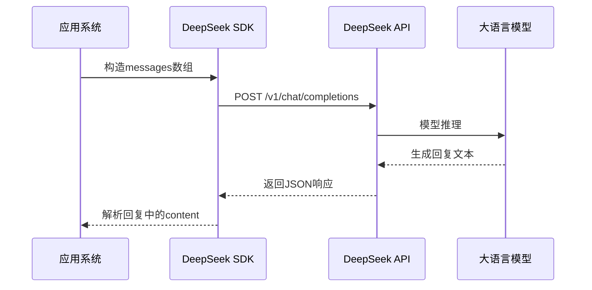
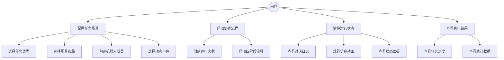
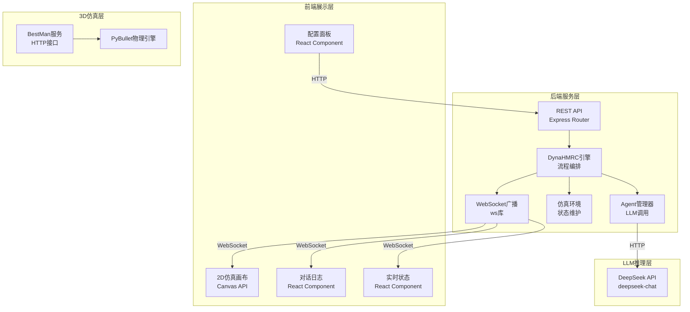
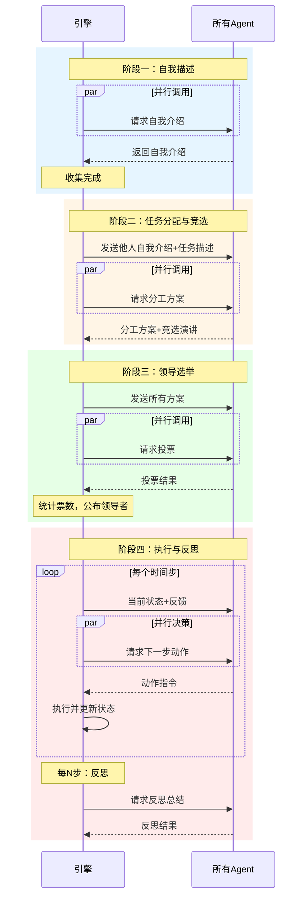
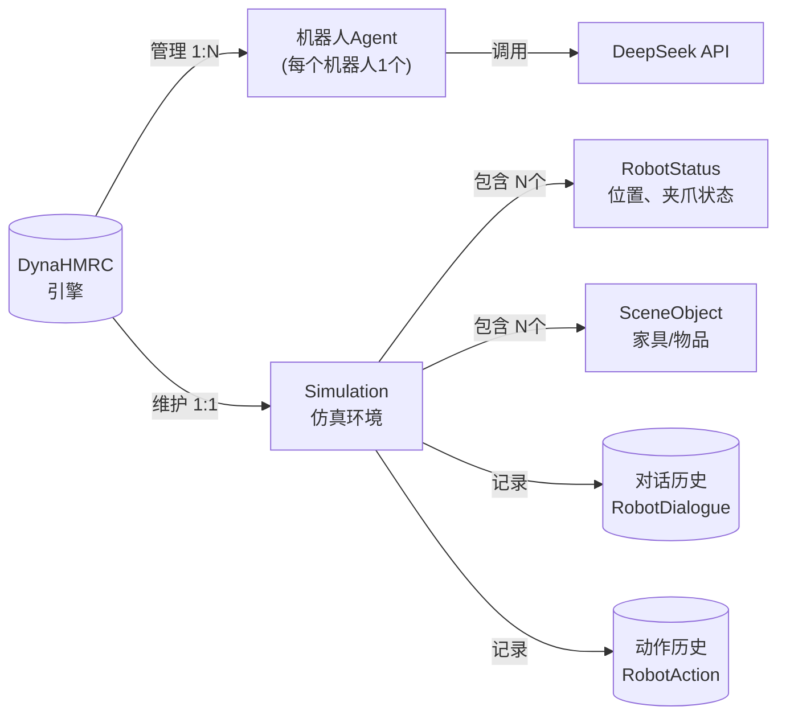

# 本科毕业设计（论文）

**题目：基于大语言模型的异构多机器人动态协作系统的设计与实现**

**Design and Implementation of a Decentralized Heterogeneous Multi-Robot Collaboration System Based on Large Language Models**

---

<div style="page-break-after: always;"></div>

## 摘  要

随着机器人技术在仓储物流、智能制造和家庭服务等领域的广泛应用，多机器人协作系统面临的任务复杂度与动态环境不确定性日益增加。传统多机器人协作方法多依赖预设规则或集中式调度，难以灵活应对任务目标变更、区域受限和环境突发变化等动态事件。近年来，大语言模型（Large Language Model, LLM）在推理决策、自然语言理解和多步规划等方面展现出强大能力，为机器人自主协作提供了新的技术路径。

本文设计并实现了一个基于大语言模型的异构多机器人动态协作系统DynaHMRC。该系统围绕"自我描述—任务分配与竞选—领导选举—闭环执行与反思"四阶段协作流程，利用DeepSeek大语言模型驱动机器人Agent进行自主决策、任务协商和动态调整。系统支持四种异构机器人角色，覆盖三明治制作、固体分类和物品打包三种典型协作任务场景。后端采用Node.js + Express + WebSocket架构，前端采用React + Vite + Canvas 2D技术构建实时仿真与交互界面，内置A*路径规划器和2D仿真环境，并集成了BestMan 3D物理仿真引擎。

本文围绕系统的完整实现过程展开论述，从需求分析、架构设计、详细实现到系统测试进行了全面描述。测试结果表明，系统能够完成多轮对话协作，领导者选举后可有效分配任务，机器人Agent能够根据反思结果调整规划策略，在动态环境变化下具备自适应能力。该系统为基于LLM的多机器人协作研究提供了一个可运行的工程实现参考。

**关键词：** 大语言模型；异构多机器人；动态协作；多Agent系统；DeepSeek

<div style="page-break-after: always;"></div>

## Abstract

With the widespread application of robotic technology in warehouse logistics, intelligent manufacturing, and home services, the task complexity and environmental uncertainty facing multi-robot collaboration systems are increasing. Traditional multi-robot collaboration methods rely heavily on predefined rules or centralized scheduling, making them inflexible in responding to dynamic events such as task objective changes, zone restrictions, and sudden environmental changes. In recent years, Large Language Models (LLMs) have demonstrated strong capabilities in reasoning, decision-making, natural language understanding, and multi-step planning, offering new technical pathways for autonomous multi-robot collaboration.

This thesis designs and implements DynaHMRC, a decentralized heterogeneous multi-robot collaboration system based on large language models. The system follows a four-stage collaboration pipeline: Self-Description, Task Allocation & Leadership Bidding, Leader Election, and Closed-Loop Execution & Reflection. It leverages the DeepSeek LLM to drive robot agents in autonomous decision-making, task negotiation, and dynamic adaptation. The system supports four heterogeneous robot roles and covers three typical collaboration task scenarios: sandwich making, solids sorting, and object packing. The backend is built with Node.js + Express + WebSocket, and the frontend uses React + Vite + Canvas 2D for real-time simulation and interactive visualization. The system incorporates an A* path planner and a 2D simulation environment, and integrates the BestMan 3D physics simulation engine.

This thesis describes the complete implementation process, including requirements analysis, architecture design, detailed implementation, and system testing. Experimental results demonstrate that the system can perform multi-round collaborative dialogues, effectively allocate tasks after leader election, and adjust planning strategies based on reflection results, exhibiting adaptive capabilities under dynamic environmental changes. The system provides a runnable engineering reference for LLM-based multi-robot collaboration research.

**Keywords:** Large Language Model; Heterogeneous Multi-Robot; Dynamic Collaboration; Multi-Agent System; DeepSeek

<div style="page-break-after: always;"></div>

## 目  录

摘  要 &nbsp;&nbsp;&nbsp;&nbsp;I
Abstract &nbsp;&nbsp;&nbsp;&nbsp;II
第1章 绪论 &nbsp;&nbsp;&nbsp;&nbsp;1
&nbsp;&nbsp;1.1 研究背景与意义 &nbsp;&nbsp;&nbsp;&nbsp;1
&nbsp;&nbsp;1.2 国内外研究现状 &nbsp;&nbsp;&nbsp;&nbsp;2
&nbsp;&nbsp;1.3 论文主要工作 &nbsp;&nbsp;&nbsp;&nbsp;4
&nbsp;&nbsp;1.4 论文组织结构 &nbsp;&nbsp;&nbsp;&nbsp;5
第2章 相关技术基础 &nbsp;&nbsp;&nbsp;&nbsp;6
&nbsp;&nbsp;2.1 大语言模型 &nbsp;&nbsp;&nbsp;&nbsp;6
&nbsp;&nbsp;2.2 Web开发技术 &nbsp;&nbsp;&nbsp;&nbsp;7
&nbsp;&nbsp;2.3 机器人仿真技术 &nbsp;&nbsp;&nbsp;&nbsp;8
第3章 系统需求分析 &nbsp;&nbsp;&nbsp;&nbsp;10
&nbsp;&nbsp;3.1 可行性分析 &nbsp;&nbsp;&nbsp;&nbsp;10
&nbsp;&nbsp;3.2 功能需求分析 &nbsp;&nbsp;&nbsp;&nbsp;11
&nbsp;&nbsp;3.3 非功能需求分析 &nbsp;&nbsp;&nbsp;&nbsp;12
&nbsp;&nbsp;3.4 用例分析 &nbsp;&nbsp;&nbsp;&nbsp;12
第4章 系统总体设计 &nbsp;&nbsp;&nbsp;&nbsp;14
&nbsp;&nbsp;4.1 系统架构设计 &nbsp;&nbsp;&nbsp;&nbsp;14
&nbsp;&nbsp;4.2 四阶段协作流程设计 &nbsp;&nbsp;&nbsp;&nbsp;15
&nbsp;&nbsp;4.3 机器人角色定义 &nbsp;&nbsp;&nbsp;&nbsp;18
&nbsp;&nbsp;4.4 任务场景设计 &nbsp;&nbsp;&nbsp;&nbsp;19
&nbsp;&nbsp;4.5 动态变化机制设计 &nbsp;&nbsp;&nbsp;&nbsp;20
&nbsp;&nbsp;4.6 数据实体设计 &nbsp;&nbsp;&nbsp;&nbsp;21
&nbsp;&nbsp;4.7 感知模块设计 &nbsp;&nbsp;&nbsp;&nbsp;22
&nbsp;&nbsp;4.8 记忆模块设计 &nbsp;&nbsp;&nbsp;&nbsp;24
&nbsp;&nbsp;4.9 规划模块设计 &nbsp;&nbsp;&nbsp;&nbsp;25
&nbsp;&nbsp;4.10 反思模块设计 &nbsp;&nbsp;&nbsp;&nbsp;27
第5章 系统实现 &nbsp;&nbsp;&nbsp;&nbsp;28
&nbsp;&nbsp;5.1 开发环境 &nbsp;&nbsp;&nbsp;&nbsp;28
&nbsp;&nbsp;5.2 后端服务实现 &nbsp;&nbsp;&nbsp;&nbsp;28
&nbsp;&nbsp;5.3 感知模块实现 &nbsp;&nbsp;&nbsp;&nbsp;32
&nbsp;&nbsp;5.4 记忆模块实现 &nbsp;&nbsp;&nbsp;&nbsp;33
&nbsp;&nbsp;5.5 规划模块实现 &nbsp;&nbsp;&nbsp;&nbsp;34
&nbsp;&nbsp;5.6 反思模块实现 &nbsp;&nbsp;&nbsp;&nbsp;35
&nbsp;&nbsp;5.7 前端界面实现 &nbsp;&nbsp;&nbsp;&nbsp;36
&nbsp;&nbsp;5.8 BestMan 3D仿真集成 &nbsp;&nbsp;&nbsp;&nbsp;38
第6章 系统测试 &nbsp;&nbsp;&nbsp;&nbsp;30
&nbsp;&nbsp;6.1 测试环境 &nbsp;&nbsp;&nbsp;&nbsp;30
&nbsp;&nbsp;6.2 测试方法 &nbsp;&nbsp;&nbsp;&nbsp;30
&nbsp;&nbsp;6.3 场景一测试：三明治制作 &nbsp;&nbsp;&nbsp;&nbsp;31
&nbsp;&nbsp;6.4 场景二测试：固体分类 &nbsp;&nbsp;&nbsp;&nbsp;32
&nbsp;&nbsp;6.5 场景三测试：物品打包 &nbsp;&nbsp;&nbsp;&nbsp;33
&nbsp;&nbsp;6.6 动态环境测试 &nbsp;&nbsp;&nbsp;&nbsp;34
&nbsp;&nbsp;6.7 接口测试 &nbsp;&nbsp;&nbsp;&nbsp;35
&nbsp;&nbsp;6.8 测试结果分析 &nbsp;&nbsp;&nbsp;&nbsp;36
第7章 总结与展望 &nbsp;&nbsp;&nbsp;&nbsp;37
&nbsp;&nbsp;7.1 论文工作总结 &nbsp;&nbsp;&nbsp;&nbsp;37
&nbsp;&nbsp;7.2 主要创新点 &nbsp;&nbsp;&nbsp;&nbsp;37
&nbsp;&nbsp;7.3 不足之处 &nbsp;&nbsp;&nbsp;&nbsp;38
&nbsp;&nbsp;7.4 未来展望 &nbsp;&nbsp;&nbsp;&nbsp;38
参考文献 &nbsp;&nbsp;&nbsp;&nbsp;40
致  谢 &nbsp;&nbsp;&nbsp;&nbsp;42

<div style="page-break-after: always;"></div>

# 第1章 绪论

## 1.1 研究背景与意义

随着机器人技术的快速发展，多机器人协作系统在仓储物流、智能制造、家庭服务和科研探索等领域得到了广泛应用。单个机器人的能力受限于其物理结构和功能范围，难以独立完成复杂的、跨区域的协作任务，而多机器人系统通过分工协作可以大幅提升任务完成效率和系统鲁棒性。然而，多机器人系统面临的核心挑战在于如何让不同型号、不同能力的机器人之间进行有效沟通、协商和任务分配，以及如何在动态变化的环境中灵活调整协作策略。

异构多机器人系统是指由具有不同功能、不同运动能力和不同操作能力的机器人组成的协作群体。相比于同构机器人系统，异构系统能够发挥各机器人的独特优势：移动机器人负责广域探索，机械臂负责精确操作，无人机负责高空作业。但异构系统也带来了更大的协调难度——各机器人需要彼此理解对方的能力边界，才能进行合理的任务分工。如何在信息不完全共享的条件下实现高效协作，是当前研究的热点问题。

传统多机器人协作方法主要包括基于行为的控制方法、基于市场机制的任务分配方法和集中式规划方法。基于行为的方法通过预设规则控制机器人的行为响应，适用于结构化场景但缺乏灵活性；基于市场机制的方法通过任务拍卖实现去中心化协调，但通信开销较大；集中式规划方法具有全局最优性，但在线计算复杂度高，且存在单点故障风险。这些方法在处理动态环境变化时存在以下局限性：第一，预设规则难以覆盖所有可能的任务变化场景；第二，对自然语言指令的理解能力较弱；第三，缺乏自主重规划能力，一旦执行偏离计划难以自我修正。

近年来，大语言模型（Large Language Model, LLM）在自然语言理解、逻辑推理、多步规划和代码生成等任务中展现出超越传统方法的性能。GPT系列[13]、Claude和DeepSeek[14]等模型不仅在问答场景中表现出色，还被逐步应用于机器人任务规划、人机交互和自主决策领域。LLM能够理解自然语言描述的任务目标，生成结构化的执行计划，并在执行过程中根据反馈信息进行反思和调整。这为构建更加灵活和通用的多机器人协作系统提供了新的技术可能性。

本文所设计的DynaHMRC系统正是在上述背景下提出。该系统将大语言模型作为机器人的"大脑"，通过精心设计的提示词（Prompt）模板驱动四阶段协作流程，使异构机器人能够像人类团队一样进行自我介绍、讨论分工、投票选举领导，并在执行过程中持续反思和改进。系统同时提供了2D仿真环境和3D物理仿真两种运行模式，便于算法验证和效果展示。

本课题的研究意义体现在以下三个方面：

（1）探索了大语言模型在异构多机器人任务分配与动态协作中的应用路径，为相关研究提供了一个可运行的工程实现参考。

（2）设计了一套完整的四阶段协作流程和提示词模板体系，覆盖了从角色认知到任务执行的完整协作生命周期。

（3）实现了一个包含后端服务、前端交互界面和仿真环境的完整系统，支持三种任务场景和四种动态环境变化类型。

## 1.2 国内外研究现状

### 1.2.1 多机器人任务分配方法

多机器人任务分配（Multi-Robot Task Allocation, MRTA）是多机器人协作领域的核心问题。传统方法主要包括基于市场机制的拍卖方法、基于群体智能的优化方法和基于行为树的控制方法。Dias等人提出了TraderBots系统，将市场机制引入多机器人任务分配，通过任务拍卖实现去中心化协调[1]。Gerkey和Matarić提出了面向任务的MRTA分类框架，将问题划分为单任务/多任务（ST/MR）、单机器人/多机器人（SR/MR）和即时分配/时间扩展分配（IA/TA）等维度[2]，为后续研究提供了统一的分类基础。

近年来，随着深度强化学习的发展，基于学习的任务分配方法逐渐兴起。Sunehag等人提出了基于值函数分解的多Agent强化学习方法VDN（Value-Decomposition Networks）[3]，将联合Q函数分解为个体Q函数的和。Rashid等人进一步提出了QMIX方法，通过混合网络（Mixing Network）实现更高效的多Agent协作[4]。然而，这些方法通常需要大量的训练时间，且泛化能力受限于训练场景的覆盖范围。

### 1.2.2 基于LLM的机器人决策

将大语言模型应用于机器人决策是近年来迅速发展的研究方向。Ahn等人提出了PaLM-SayCan系统，将LLM（PaLM）与机器人技能库相结合，使机器人能够根据自然语言指令进行任务规划[5]。该系统利用LLM的常识推理能力将高层指令分解为可执行的子任务序列，再通过可执行性评分（Affordance）筛选可行动作。Huang等人提出了LLM-Planner，利用大语言模型为具身Agent生成任务计划[6]，在环境交互过程中动态调整计划。

在多Agent协作方面，Zhang等人提出了基于LLM的多Agent系统框架，通过对话驱动的协商机制实现Agent之间的任务协调[7]。Li等人提出了RoCo系统，利用LLM进行多机器人通信和协调决策[8]。然而，现有研究大多集中在同构机器人或简化协作场景，对于异构机器人之间的复杂协作（如无人机与地面机器人的协同），以及动态环境下的自适应重规划，仍有较大的探索空间。本文研究的DynaHMRC系统正是在这一方向上的探索尝试。

### 1.2.3 动态环境下的自适应协作

动态环境下的自适应协作是多机器人系统在实际应用中必须面对的问题。常见的动态事件包括任务目标变更、工作区域受限、机器人故障和团队重组等。Huang等人研究了基于情境评估的动态任务重分配方法，当环境变化触发重分配条件时，系统重新进行任务指派[9]。Trodden等人提出了基于模型预测控制（MPC）的分布式协调方法，能够实时处理移动障碍物和动态约束[10]。

DynaHMRC的核心理念参考了人类团队协作中的四种动态事件分类：目标变更（Change Task Objective, CTO）、禁区约束（Interdicted Restricted Zone, IRZ）、动作约束（Action Constraint, ANC）和团队重组（Reconfiguration, REC）[11]。这些分类为动态环境下的协作研究提供了系统化的思考框架，本文在此基础上设计了相应的响应机制。

## 1.3 论文主要工作

本文的主要工作包括以下几个方面：

（1）设计并实现了基于DeepSeek大语言模型的四阶段异构多机器人协作流程，包括自我描述、任务分配与竞选、领导选举以及闭环执行与反思。每个阶段都设计了专门的提示词模板，使LLM能够理解机器人身份、任务目标和协作规则。通过并行化LLM调用，将多Agent的协作决策时间缩短至串行方案的约25%。

（2）构建了一个包含四种异构机器人（移动操作臂Alice、固定操作臂Bob、纯移动机器人David和无人机Lucy）的仿真系统，每种机器人具有差异化的能力集和动作集。系统支持三明治制作（Make Sandwich）、固体分类（Sort Solids）和物品打包（Pack Objects）三种典型任务场景。

（3）实现了一个完整的Web前后端系统，后端采用Node.js + Express + WebSocket架构，前端采用React + Vite + Canvas 2D技术。系统提供了配置面板、2D仿真画布、对话日志面板和实时状态面板，为用户提供了直观的交互体验。

（4）集成了BestMan 3D物理仿真引擎，为每种任务场景搭建了3D环境，实现了机械臂逆运动学控制、无人机飞行控制和物品物理操作。

（5）实现了四种动态环境变化机制，能够模拟任务执行过程中的突发事件，验证了系统在动态变化下的自适应能力。

## 1.4 论文组织结构

全文共分为七章，组织结构如下：

第一章为绪论，介绍研究背景与意义、国内外研究现状和本文主要工作。

第二章为相关技术基础，介绍大语言模型、Web开发技术和机器人仿真技术。

第三章为系统需求分析，从可行性、功能需求、非功能需求和用例分析四个方面进行阐述。

第四章为系统总体设计，包括系统架构设计、四阶段协作流程设计、机器人角色定义、任务场景设计和动态变化机制设计。

第五章为系统实现，详细介绍后端服务、前端界面、2D仿真环境和BestMan 3D仿真集成的实现过程。

第六章为系统测试，从功能测试、场景测试和动态环境测试三个方面对系统进行验证。

第七章为总结与展望，总结本文工作，分析不足并提出未来改进方向。

<div style="page-break-after: always;"></div>

# 第2章 相关技术基础

## 2.1 大语言模型

### 2.1.1 Transformer架构

大语言模型基于Transformer架构[12]，通过在海量文本数据上进行预训练，学习到丰富的语言知识和推理能力。Transformer模型的核心组件包括多头自注意力机制（Multi-Head Self-Attention）和前馈神经网络（Feed-Forward Network）。自注意力机制使模型能够捕获输入序列中任意两个位置之间的依赖关系，这对于理解上下文和生成连贯的输出至关重要。

自注意力机制的计算如公式（2-1）所示：

$$
\text{Attention}(Q,K,V) = \text{softmax}\left(\frac{QK^T}{\sqrt{d_k}}\right)V \tag{2-1}
$$

其中$Q$（查询）、$K$（键）和$V$（值）由输入序列通过线性变换得到，$d_k$为缩放因子。多头注意力将多个注意力头的输出拼接后通过线性层得到最终结果，如公式（2-2）所示：

$$
\text{MultiHead}(Q,K,V) = \text{Concat}(\text{head}_1, \ldots, \text{head}_h)W^O \tag{2-2}
$$

其中每个注意力头的计算为$\text{head}_i = \text{Attention}(QW_i^Q, KW_i^K, VW_i^V)$。

### 2.1.2 DeepSeek模型

DeepSeek系列大语言模型是由深度求索公司开发的大规模语言模型[14]。DeepSeek模型在多个自然语言处理基准测试中表现优异，特别在推理任务、代码生成和长文本理解方面具有突出能力。本文所使用的deepseek-chat模型具有以下特点：

（1）强大的中文理解与生成能力，能够准确理解复杂的任务描述和场景信息。

（2）良好的指令遵循能力，能够按照结构化提示词模板生成符合格式要求的输出。

（3）多步推理能力，能够在复杂任务场景中进行逐步推理和规划。

（4）支持角色扮演，能够根据不同机器人的身份设定生成风格一致的回复。

DeepSeek模型通过API接口提供服务，开发者可以通过HTTP请求向模型发送对话消息并获取响应。标准的API调用消息格式包括system消息（系统设定）和user消息（用户输入），模型返回assistant消息（模型回复）。API调用流程如图2-1所示。



**图2-1 DeepSeek API调用流程图**

## 2.2 Web开发技术

### 2.2.1 Node.js与Express框架

Node.js是一个基于Chrome V8引擎的JavaScript运行时环境，采用事件驱动和非阻塞I/O模型，适合构建高性能的网络应用。Node.js使用npm（Node Package Manager）管理依赖包，拥有庞大的开源生态系统。

Express是Node.js平台最流行的Web应用框架，提供了简洁的路由定义、中间件机制和HTTP请求处理接口。本文系统采用Express搭建后端REST API服务，并通过HTTP服务器模块集成WebSocket支持。Express的中间件机制使系统能够方便地添加日志记录、错误处理和请求验证等功能。

### 2.2.2 WebSocket实时通信

WebSocket是一种在单个TCP连接上提供全双工通信的协议，由RFC 6455定义。相比传统的HTTP轮询方式，WebSocket能够显著降低通信延迟和服务器负载。本文系统使用ws库实现WebSocket服务器，用于向前端实时推送机器人对话和仿真状态更新。

系统采用发布-订阅模式管理WebSocket连接：每个仿真运行实例（Run）拥有独立的WebSocket连接池，后端通过回调函数将状态变化广播到对应连接池中的所有前端客户端。这种设计确保了多实例运行的隔离性，也降低了前端轮询的开销。

### 2.2.3 React与Vite前端技术

React是由Facebook开发的用于构建用户界面的JavaScript库，采用组件化开发模式和虚拟DOM（Virtual DOM）技术，能够高效地管理和更新复杂的前端界面。Vite是一个现代化的前端构建工具，利用原生ES模块实现快速的开发服务器启动和热模块替换（HMR）。

本文前端采用React + TypeScript + Vite技术栈，构建了包含配置面板、2D仿真画布、对话日志面板和实时状态面板的完整交互界面。Canvas 2D API用于实现机器人和场景的平滑动画渲染，`requestAnimationFrame`驱动动画循环以保证30fps以上的刷新率。

## 2.3 机器人仿真技术

### 2.3.1 PyBullet物理引擎

PyBullet是一个开源物理引擎，支持刚体动力学、碰撞检测、逆运动学求解和传感器仿真。PyBullet提供了Python接口，能够加载URDF（Unified Robot Description Format）格式的机器人模型，进行物理仿真和运动控制。PyBullet支持GUI模式和DIRECT模式两种运行方式，GUI模式提供3D可视化窗口，DIRECT模式适合无图形界面的服务器环境。

本文系统的3D仿真基于PyBullet构建，通过BestMan框架集成了机器人模型加载、仿真步进和运动控制功能。在仿真循环中，每隔固定时间步调用`p.stepSimulation()`更新物理状态。

### 2.3.2 逆运动学与路径规划

逆运动学（Inverse Kinematics, IK）是机器人学中的基本问题——给定末端执行器的目标位置和姿态，求解各关节角度。对于六轴机械臂（如xArm6），IK解可以通过数值方法求解。PyBullet的IK求解器使用阻尼最小二乘法（Damped Least Squares, DLS）进行数值优化，通过指定初始姿态（rest pose）和迭代次数获得最优解。

路径规划是机器人导航的核心问题。A*（A-Star）算法是一种启发式搜索算法，通过评价函数$f(n) = g(n) + h(n)$引导搜索过程，其中$g(n)$是从起点到当前节点的实际代价，$h(n)$是当前节点到目标节点的估计代价（通常使用欧几里得距离或曼哈顿距离）。本文系统使用A*算法在栅格地图上规划机器人的二维导航路径，栅格分辨率为0.15m/格，路径规划器考虑了墙壁、家具等静态障碍物的碰撞检测。

<div style="page-break-after: always;"></div>

# 第3章 系统需求分析

## 3.1 可行性分析

### 3.1.1 技术可行性

本文系统采用Node.js + Express构建后端服务，DeepSeek API提供LLM推理能力，React + Vite构建前端界面，PyBullet实现3D仿真。上述技术均已成熟并得到广泛使用。Node.js的事件驱动架构适合处理WebSocket实时通信；DeepSeek API提供高可用的对话接口，单次推理响应时间通常在1~3秒内；PyBullet作为开源物理引擎，提供了完善的机器人仿真API。系统开发所需技术栈覆盖完整，技术可行性得到保障。

### 3.1.2 经济可行性

系统开发所需软件均为开源或免费授权。Node.js、React、PyBullet以及DeepSeek API（提供免费试用额度）均可在互联网上免费获取。硬件需求方面，系统可在普通开发计算机（8GB以上内存、主流处理器）上运行，无需专用服务器或高性能计算设备。DeepSeek API按token计费，单次任务执行约消耗数千至数万token，成本在可接受范围内。因此，系统开发和使用在经济上完全可行。

### 3.1.3 操作可行性

系统提供Web界面进行交互，用户通过浏览器即可完成场景配置、任务启动和状态监控。前端的2D仿真画布和实时状态面板提供了直观的可视化反馈。3D仿真模式可通过命令行单独启动，用户可根据需要选择运行模式。前端界面设计简洁，关键功能按钮位置明确，操作流程清晰，具有较好的可用性。对于部署人员而言，系统只需配置DeepSeek API Key即可运行，操作门槛低。

## 3.2 功能需求分析

根据系统设计目标，本文将功能需求划分为系统管理、场景配置、协作执行和仿真可视化四大类。具体的功能需求如表3-1所示。

**表3-1 系统功能需求表**

| 序号 | 功能模块 | 需求描述 | 优先级 |
|:----:|:---------|:---------|:-----:|
| F1 | 任务类型选择 | 支持选择三明治制作、固体分类、物品打包三种任务 | 高 |
| F2 | 场景布局选择 | 支持选择三种不同的房间布局（分别对应各任务） | 高 |
| F3 | 机器人配置 | 支持选择参与任务的机器人成员 | 中 |
| F4 | 动态事件配置 | 支持启用目标变更、禁区约束等动态事件 | 中 |
| F5 | 最大步数设置 | 可设置仿真执行的最大步数限制 | 中 |
| F6 | 四阶段协作执行 | 按自我描述→分工竞选→选举→执行反思流程自动运行 | 高 |
| F7 | 对话日志显示 | 实时显示各阶段机器人的思考和发言内容 | 高 |
| F8 | 2D仿真可视化 | 使用Canvas渲染机器人移动、物品操作和场景变化 | 高 |
| F9 | 实时状态面板 | 显示机器人位置、夹爪状态、任务进度等信息 | 高 |
| F10 | 3D仿真集成 | 集成BestMan引擎实现3D物理仿真 | 低 |
| F11 | 运行控制 | 支持开始、暂停、恢复和停止仿真运行 | 高 |

## 3.3 非功能需求分析

系统的非功能需求直接影响整体的可用性和工程质量，具体如表3-2所示。

**表3-2 系统非功能需求表**

| 类别 | 需求内容 | 说明 |
|:----:|:---------|:-----|
| 性能 | LLM单次响应时间<5秒 | DeepSeek API调用不超过5秒 |
| 性能 | 前端刷新率>30fps | 仿真画布动画保持流畅 |
| 可靠性 | 50步仿真内无崩溃 | 引擎状态保持一致性 |
| 可扩展性 | 支持新增任务场景和机器人类型 | 通过配置方式进行扩展 |
| 可用性 | 关键功能2次点击内可达 | 界面布局合理 |
| 安全性 | API Key在服务端配置 | 不向客户端暴露密钥 |

## 3.4 用例分析

系统面向的主要用户为研究人员或系统演示人员，用户通过Web界面进行场景配置和运行观察。系统的核心用例如图3-1所示。



**图3-1 系统用例图**

主要用例说明如下：

- **UC1 配置任务场景**：用户选择任务类型、场景布局、参与机器人和启用的动态事件，点击创建按钮生成运行实例。
- **UC2 启动协作流程**：用户通过WebSocket发送start命令，DynaHMRC引擎按照四阶段流程自动执行。
- **UC3 监控运行状态**：用户在仿真执行过程中实时观看对话日志、2D动画和机器人状态变化。
- **UC4 查看执行结果**：任务执行完成后展示进度和完成情况。

<div style="page-break-after: always;"></div>

# 第4章 系统总体设计

## 4.1 系统架构设计

DynaHMRC系统采用前后端分离的B/S（Browser/Server）架构，将系统划分为LLM推理层、后端服务层、前端展示层和3D仿真层四个层次。各层之间职责明确，通过HTTP接口和WebSocket协议进行通信，整体架构如图4-1所示。



**图4-1 系统总体架构图**

系统自下而上分为四层：

（1）**LLM推理层**：通过DeepSeek API提供大语言模型推理能力，负责处理机器人Agent的决策请求。每个机器人拥有独立的Agent实例，通过定制的提示词模板生成结构化的决策输出。

（2）**后端服务层**：使用Node.js + Express构建，包括DynaHMRC引擎、机器人Agent管理器、Simulation仿真环境和WebSocket广播系统。DynaHMRC引擎负责编排四阶段协作流程，Simulation环境维护场景图和机器人状态，WebSocket将实时数据推送给前端。

（3）**前端展示层**：使用React + Vite构建，包含配置面板、仿真画布、对话面板和实时状态面板四个核心组件。前端通过WebSocket接收后端推送的状态更新，实时渲染仿真画面。

（4）**3D仿真层**（可选）：使用BestMan（基于PyBullet）构建3D物理仿真环境，通过HTTP接口与后端服务通信，提供更逼真的3D可视化效果。

## 4.2 四阶段协作流程设计

DynaHMRC系统的核心创新在于四阶段协作流程，如图4-2所示。该流程模拟了人类团队协作的基本过程：相互认识→讨论分工→投票选举→执行改进。



**图4-2 四阶段协作流程图**

### 4.2.1 第一阶段：自我描述

在自我描述阶段，每个机器人Agent向团队成员介绍自己的类型、能力和角色定位。系统向DeepSeek API发送包含机器人能力定义的提示词，机器人Agent输出一段自然语言风格的自我介绍。该阶段的目的是建立团队共识，使每个成员了解其他成员的能力边界。实际运行中，各机器人的自我介绍示例如下：

> **Alice**：大家好！我是Alice，一台移动操作机器人。我可以在地面上自由导航，打开柜门，捡取物品并精准放置。我还是一个不错的团队协调者，能够在复杂任务中发挥我的机动性优势！
>
> **Bob**：各位好，我是Bob，一台固定式桌面操作臂。虽然我不能移动，但我擅长精确抓取和放置操作，适合完成精细的装配任务。
>
> **David**：我是David，一台纯移动机器人。我可以高效导航和探索环境，但不具备操作物体的能力。我负责为团队提供环境信息和导航支持。
>
> **Lucy**：大家好！我是Lucy，一台四旋翼无人机。我可以飞到高处和难以到达的区域，从上面抓取物品。适合完成高空侦察和取物任务。

### 4.2.2 第二阶段：任务分配与竞选

在第二阶段，每个机器人根据任务目标和团队能力分布，提出分工方案和竞选演讲。系统将所有人的自我介绍拼接后作为上下文发送给每个Agent，Agent输出分工方案和竞选演讲。

该阶段的提示词引导Agent从以下角度思考：各机器人的独特能力如何与任务需求匹配；如何实现并行工作以最大化效率；自身相对于其他成员的优势对于领导角色的适配度。

### 4.2.3 第三阶段：领导选举

在第三阶段，所有机器人阅读他人的分工方案后，投票选举领导者。系统收集所有投票后统计票数，得票最高者当选为团队领导。选举算法如代码清单4-1所示。

```typescript
/**
 * 代码清单4-1：领导选举算法核心实现
 * 功能：并行收集所有机器人的投票并统计结果
 */
const votes: Record<string, string> = {};
await Promise.all(
  this.robotConfigs.map(async ([name]) => {
    const agent = this.agents[name];
    const [thoughts, content, vote] = await agent.voteLeader(allPlans);
    votes[name] = vote;
  })
);

// 统计票数
const voteCounts: Record<string, number> = {};
for (const candidate of Object.values(votes)) {
  voteCounts[candidate] = (voteCounts[candidate] || 0) + 1;
}

// 选出得票最高者，平局时默认选第一位机器人
this.leader = Object.keys(voteCounts).length > 0
  ? Object.entries(voteCounts).sort((a, b) => b[1] - a[1])[0][0]
  : this.robotConfigs[0][0];
```

### 4.2.4 第四阶段：闭环执行与反思

执行阶段是系统的核心运行环节。每个时间步中，每个机器人Agent根据当前场景状态、任务进度和历史反馈信息，通过LLM决定下一步动作。动作类型包括导航（navigate）、捡取（pick）、放置（place）、打开（open）、通信（communicate）和等待（wait）。系统内置两层约束确保动作的物理合理性：① 能力约束（如David不能执行pick操作）；② 状态约束（如夹爪非空时不能执行pick）。

系统定期（每5步）触发反思环节：每个机器人分析当前任务进度与目标的差距，总结经验教训，提出改进计划；领导者汇总所有成员的反思结果，更新协作计划。反思机制的引入使系统具备了闭环控制能力——Agent能够根据执行反馈动态调整行为策略，而非盲目执行预设计划。

## 4.3 机器人角色定义

异构多机器人系统的核心优势在于各机器人的能力互补。不同能力的机器人通过分工协作能够完成单个机器人无法独立完成的任务。DynaHMRC系统定义了四种能力差异化的机器人角色，涵盖地面移动、空中飞行、物品操作和固定精密操作四种基本能力维度。各角色的能力差异通过能力矩阵（表4-1）明确定义，这些定义直接映射到Agent的提示词模板中，使LLM能够准确理解每个机器人的能力边界。

**表4-1 机器人能力矩阵**

| 能力项 | Alice（移动操作臂） | Bob（固定操作臂） | David（移动机器人） | Lucy（无人机） |
|:------:|:-----------------:|:---------------:|:----------------:|:------------:|
| 地面导航 | ✓ | ✗ | ✓ | ✗ |
| 空中导航 | ✗ | ✗ | ✗ | ✓ |
| 物品捡取 | ✓ | ✓ | ✗ | ✓ |
| 物品放置 | ✓ | ✓ | ✗ | ✓ |
| 打开容器 | ✓ | ✗ | ✗ | ✗ |
| 通信交互 | ✓ | ✓ | ✓ | ✓ |

各机器人的角色定位和协作分工详述如下。

**Alice（移动操作臂）**：Alice是系统中最全面的机器人角色，搭载于轮式底盘（Segbot）上，配备六轴xArm6机械臂。她兼具地面导航能力和物品操作能力，能够自主导航到场景中的任意可达位置，完成物品捡取、放置和容器打开等操作。在协作流程中，Alice通常承担探索、捡取和运输等多重任务——她可以从厨房柜中取出叉子，从桌面上拿起食物材料，然后将物品运送到Bob的工作台。由于其能力全面性，在多数测试场景中Alice被其他机器人选举为团队领导者。Alice的初始位置根据场景不同而变化，在场景一中位于(6.5, 7)的厨房区域，在场景二中位于(8, 6)的右侧区域，在场景三中位于(5, 3)的中央区域。

**Bob（固定操作臂）**：Bob是一台固定安装在工作台上的六轴xArm6机械臂，不具备移动能力。他的核心优势在于操作的精确性——由于机械臂固定安装，他的末端执行器定位精度优于移动机器人。Bob适合完成对位置精度要求较高的操作，如将物品精确堆叠在目标位置或放入容器。Bob的局限性在于他的操作范围受限于机械臂的物理臂展（约0.7m），因此他只能操作已经放置在他工作台上的物品。在协作流程中，其他机器人负责探索和运输，将物品送到Bob的工作台上，Bob则负责最终的精确放置。Bob的工作台位置在场景一中为(8.5, 5.85)的实验桌，在场景二和场景三中固定在分类桌旁。

**David（纯移动机器人）**：David是一台仅配备轮式底盘的移动机器人，不具备任何物品操作能力。他的唯一能力是在场景中进行地面导航。在协作流程中，David充当侦察兵的角色——他可以在场景中快速导航，探索未知区域，发现物品位置并向团队报告。David的存在体现了异构团队中

## 4.4 任务场景设计

系统定义了三种任务场景，每种场景对应一种典型的协作模式：三明治制作（顺序堆叠）、固体分类（颜色匹配）和物品打包（集中放置）。三种场景的复杂度逐步递增，覆盖了从线性操作到并行协作的不同维度。

### 4.4.1 场景一：三明治制作（顺序堆叠）

场景一对应三明治制作任务，房间布局为10m×8m，包含厨房、餐厅、实验区和卫生间四个功能区域。任务目标是将三种食材——面包片1（bread_0，位于实验桌new_table_2，坐标(8.2, 5.85)）、培根片（bacon，位于源桌new_table_1，坐标(8.5, 4.0)）和面包片2（bread_1，同样位于源桌new_table_1，坐标(8.55, 4.2)）——按bread_0→bacon→bread_1的顺序垂直堆叠在案板（cutting_board，位于(8.5, 5.5)）上。

场景布局包含以下关键区域：厨房区（右下角x=5~10, y=0~4），包含冰箱、灶台和微波炉等设施，通过内墙（x=5, y=0~5）与餐厅区分隔；餐厅区（左中部x=0~5, y=0~4），包含餐桌、椅子和书架；实验区（右上角x=5~10, y=4~8），包含两张实验桌、案板和托盘，Bob的固定臂安装在此区域；卫生间（左上角x=0~5, y=4~8），包含马桶和浴缸。机器人初始位置：Alice在(6.5, 7)，Bob固定在(8.5, 5.85)，David在(4, 6)，Lucy在(3, 2)。

场景一的协作模式为"运输者+操作者"分工：Alice负责从源桌导航取物并运输到Bob工作桌，Bob负责从桌面捡取物品完成垂直堆叠。该场景还考验Alice的路径规划能力——她需要在厨房区、餐厅区和实验区之间安全导航，避开墙壁、餐桌和椅子等障碍物。

### 4.4.2 场景二：固体分类（颜色匹配）

场景二对应固体分类任务，房间布局为10m×10m的L型空间。任务目标是将散落在场景各处的彩色小方块捡起并放置到对应颜色的6cm×6cm大方块上。大方块共有六种颜色（红、绿、蓝、黄、紫、橙），排列在分类桌（table2，位于(3, 5)）上，分为两排（每排三个）。

场景布局包含以下功能分区：厨房区（底部y=0~2），包含橱柜、操作台和冰箱；分类区（中部y=4~6），包含两张桌子，其中table2上摆放着6个彩色大方块，Bob的固定臂安装在table2旁；书架区（左中部x=0~2, y=6~7.5），绿色小方块放置在书架顶层(Z=2.2)；休息区（右上角x=6~10, y=8~10），包含沙发和地毯。各小方块的初始位置覆盖了不同高度层次（地面、桌面、书架顶层），对机器人的空间感知和导航能力提出了要求。

场景二的协作链为：David（纯移动机器人）探索并报告小方块位置→Alice或Lucy前往取物→运输到分类桌→Bob精确放置到匹配颜色的大方块上。该场景还涉及办公室内的颜色匹配逻辑——Agent需要理解"small_cube_green应放在cube_green上"的匹配规则。

### 4.4.3 场景三：物品打包（并行收集）

场景三对应物品打包任务，房间布局为包含厨房区、打包区和休息区的10m×10m多隔间房间。任务目标是将4件物品（叉子fork_0、书本book_0、肥皂soap、杯子cup）从不同位置收集并统一放入位于打包桌source_table_1上的托盘tray中。

场景布局包含以下区域：厨房区（底部），橱柜中放置叉子；源桌区（中部），包含Bob的打包桌source_table_1(2,4)和source_table_2(4,4)；打包区（右侧），包含打包桌和书架（书本放置其上）；台面区（中部偏右），靠墙台面上放置肥皂。机器人初始位置：Alice在(5, 3)，Bob固定在(2, 4.4)，David在(3, 6)，Lucy在(8, 3)。

本场景通过任务并行性设计考察多机器人协作效率。Lucy（无人机）负责高空取物路线：书架取book_0→台面取soap。Alice（移动操作臂）负责地面取物路线：厨房柜取fork_0→源桌取cup。两条路径在空间上不重叠，理论上可以完全并行执行。

## 4.5 动态变化机制设计

动态环境变化是多机器人系统在实际应用中必须面对的核心挑战。DynaHMRC系统支持四种动态事件类型，用于模拟真实世界中可能发生的突发情况，验证系统在动态变化下的自适应能力。动态事件的触发时机预先定义在引擎中，当仿真步数达到预设值时自动触发。

**表4-2 动态事件类型**

| 事件类型 | 缩写 | 触发时机 | 事件描述 | 应对策略 |
|:-------:|:---:|:--------:|:---------|:--------|
| 目标变更 | CTO | Step 3 | 任务目标被替换，机器人需调整计划 | 更新目标列表、重新规划路径 |
| 禁区约束 | IRZ | Step 6 | 某区域被设为禁区，导航需避开 | 更新碰撞地图、切换导航目标 |
| 动作约束 | ANC | Step 10 | 某些动作类型被临时禁用 | 切换到允许的动作类型 |
| 团队重组 | REC | Step 14 | 机器人加入或离开团队 | 重新分配未完成任务 |

### 4.5.1 目标变更（CTO）

目标变更（Change Task Objective）事件在Step 3触发。系统将当前任务目标列表中的最后一个目标替换为一个新的目标，并通过系统消息广播给所有机器人Agent。例如，在物品打包场景中，原来的目标"apple"被替换为"toothpaste"。Agent接收到变更通知后，需要更新内部的任务目标列表，将搜索和运输的重点转向新目标。新目标对应的物品如果尚未在场景中生成，系统会自动在指定位置添加该物品的实例。

### 4.5.2 禁区约束（IRZ）

禁区约束（Interdicted Restricted Zone）事件在Step 6触发。系统在场景中的某个区域（通常选择家具密集区）设置一个半径为1.5m的圆形禁区，并在对话日志中广播禁区的中心坐标和半径信息。此后，机器人的路径规划器禁区的碰撞检测机制启动：当`is_collision()`方法检测到导航目标或中间路径点落入禁区范围内时，该路径点被标记为不可通行，规划器自动重新规划绕行路径。

### 4.5.3 动作约束（ANC）

动作约束（Action Constraint）事件在Step 10触发。系统临时禁用Agent的某类动作（如导航或捡取），Agent需要在执行决策时绕过被禁用的动作类型，选择其他可用的动作。该事件在代码中通过Agent的约束检查机制实现：当系统设置了动作约束后，Agent生成的特定类型动作会被拦截，并强制切换到通信或等待等替代动作。

### 4.5.4 团队重组（REC）

团队重组（Reconfiguration）事件在Step 14触发。系统模拟机器人加入或离开团队的情况，调整协作计划和任务分配。团队重组事件触发后，领导者Agent需要重新评估剩余任务和可用成员，更新分工方案。

## 4.6 数据实体设计

系统的运行时状态数据在内存中进行管理，无需持久化数据库。所有数据实体的生命周期从创建运行实例开始，到运行结束终止。主要数据实体包括SimulationState（仿真状态）、RobotStatus（机器人状态）、SceneObject（场景物体）、RobotDialogue（对话记录）和RobotAction（动作记录），它们之间的关系如图4-3所示。



**图4-3 系统数据实体关系图**

各实体的主要字段设计如下：

**SimulationState**是系统状态的总入口，包含以下核心字段：step（当前执行步数，从0递增至maxSteps）、stage（当前所处阶段，包括SELF_DESCRIPTION、TASK_ALLOCATION_BIDDING、LEADER_ELECTION、EXECUTION_REFLECTION和COMPLETED五种状态）、leader（由投票选举产生的领导者名称）、robots（以机器人名称为键的RobotStatus字典）、scene（以物体名称为键的SceneObject字典）、dialogues（按时间序排列的RobotDialogue数组）、actions（全历史RobotAction数组）、taskCompleted（布尔值，标记任务是否完成）。

**RobotStatus**记录单台机器人的实时状态，每步执行后更新：name（机器人名称标识）、robotType（类型枚举，包括ALICE、BOB、DAVID、LUCY）、posX和posY（当前二维位置坐标）、gripperOccupied（布尔值，夹爪是否占用）、graspingObject（夹爪中抓取的物体名称，为空时表示未抓取）。

**SceneObject**表示场景中的静态物体或动态物品：name（唯一名称标识）、category（分类枚举，取值为furniture或item）、posX和posY（位置坐标）、width和height（二维包围盒尺寸）、isContainer（布尔值，是否为容器类家具，如冰箱和柜子）、isOpen（布尔值，容器类家具是否已打开）、contains（字符串数组，记录容器内或家具表面放置的物品名称列表）。

此外，系统还维护**RobotDialogue**（记录每个阶段的机器人发言内容及思考过程）和**RobotAction**（记录每个动作的类型、参数和时间戳），这两类数据主要用于前端展示和回溯分析，不参与引擎的核心决策逻辑。

## 4.7 感知模块设计

感知模块负责获取和维护系统运行所需的多维状态信息，是机器人Agent进行决策的基础。DynaHMRC系统的感知模块涵盖了环境感知、自身感知、任务感知和事件感知四个层次。

### 4.7.1 环境感知

环境感知通过仿真环境（SimEnvironment）的2D场景图实现。场景图以对象字典的形式维护所有家具和物品的位置、尺寸、状态和包含关系。每个场景物体（SceneObject）记录其名称、分类（家具/物品）、二维坐标、包围盒尺寸、是否为容器、是否打开、包含的物品列表以及机器人的可站位姿（standPose）。

环境感知的数据在每步执行后通过`getState()`方法汇总为SimulationState对象，该对象包含完整的场景快照，供Agent决策时参考。场景图的更新由动作执行触发——例如，机器人执行pick动作后，物品从场景中的容器转移到机器人夹爪中。

### 4.7.2 自身感知

每个机器人Agent通过RobotStatus对象感知自身状态，包括：名称和类型标识、当前二维位置、夹爪是否占用、抓取的物体名称。这些状态在每步执行后被更新，并通过状态广播推送给前端。

在3D仿真模式下，自身感知还包含更精细的层面：机械臂各关节角度、末端执行器位置、无人机各零件的相对偏移等，这些数据由PyBullet物理引擎直接提供。

### 4.7.3 任务感知

任务感知通过任务目标列表（taskTargets）和已放置物品列表（placedObjects）的对比实现。Agent在决策时能够获取以下任务感知信息：

- 任务目标总量和当前已完成数量
- 各目标的初始位置和当前状态（未捡取/被携带/已放置）
- 各机器人当前的携带物品状态
- 任务完成进度百分比

任务感知的数据结构化为taskProgress字符串，在每步执行时注入Agent的提示词中。

### 4.7.4 事件感知

事件感知模块负责检测和广播动态环境变化。系统预定义了四种事件类型：目标变更（CTO）、禁区约束（IRZ）、动作约束（ANC）和团队重组（REC）。事件感知的触发时机在引擎中预设，当仿真步数达到预设值时，系统生成事件消息并广播给所有Agent。

事件感知的实现如代码清单4-2所示。

```typescript
// 代码清单4-2：动态事件触发机制
const DYNAMIC_STEP_MAP: Record<string, number> = {
  'goal_change': 3,        // CTO - Step 3
  'restricted_zone': 6,    // IRZ - Step 6
  'action_constraint': 10, // ANC - Step 10
  'team_change': 14,       // REC - Step 14
};

for (const varType of this.dynamicVariations) {
  const triggerStep = DYNAMIC_STEP_MAP[varType];
  if (this.stepCount === triggerStep) {
    const msg = this.sim.enableDynamicVariation(varType);
    await this.emitDialogue({
      stage: DynaHMRCStage.EXECUTION_REFLECTION,
      robotName: '[SYSTEM]',
      content: msg, // 包含事件描述和影响
    });
  }
}
```

## 4.8 记忆模块设计

记忆模块为机器人Agent提供状态持久化和经验积累能力。DynaHMRC系统中的记忆划分为短期工作记忆、长期记忆和失败记忆三个层次。

### 4.8.1 短期工作记忆

短期工作记忆存储Agent在当前任务执行过程中产生的临时信息，包括：

- **反馈历史**（feedbackHistory）：最近5条动作执行结果的反馈，包含动作类型、是否成功、描述信息和详细数据。这些反馈信息用于LLM调整下一步动作策略。
- **动作历史**（actionHistory）：最近5条已执行动作的记录，包含动作类型和参数。动作历史用于避免重复执行相同的无效动作。
- **消息记录**（receivedMessages）：最近5条来自其他机器人的通信消息。消息记录使Agent能够感知团队协作的动态。

短期记忆在每步执行后更新，并在Agent的`act()`方法中注入提示词，使LLM能够基于完整的上下文做出决策。短期记忆的容量限制（最近5条）是一种有意设计：它防止提示词过长导致LLM注意力分散，同时迫使Agent关注最近、最相关的信息而忽略过时的反馈。

### 4.8.2 长期记忆

长期记忆存储Agent在跨任务执行周期内保持稳定的信息，包括：

- **自我认知**（selfDescription）：Agent在阶段一中生成的自我介绍文本，记录了自身的类型、能力和角色定位。该认知在后续阶段中持续使用。
- **团队分工方案**（taskPlan）：Agent在阶段二中提出的分工计划，包含自身任务分配和对其他成员的角色安排。
- **竞选演讲**（campaignSpeech）：Agent为争取领导角色而发表的演讲内容。
- **更新后计划**（currentPlan）：经过反思环节修正后的最新协作计划。

长期记忆在Agent初始化时为空，在四阶段流程中逐步填充，并在整个任务周期内保持有效。

### 4.8.3 失败记忆与重试策略

失败记忆是系统的一个重要设计，专门记录Agent在执行捡取动作时遇到的失败情况。每个Agent维护一个`failedPickItems`字典，键为物品名称，值为失败时的步数。当Agent连续对同一物品执行捡取失败时，系统会自动拦截重复尝试并强制Agent切换为等待或通信动作。

失败记忆的过期机制：当距离上次失败超过5个动作步后，失败记录自动清除，允许Agent重新尝试。这种设计避免了Agent因单次失败而永久放弃某件物品。

## 4.9 规划模块设计

规划模块是DynaHMRC系统的核心决策单元，负责从团队协作规划到个体动作决策的多个层次的规划任务。

### 4.9.1 四阶段协作规划

四阶段协作规划覆盖了从团队建立到任务执行的完整过程：

- **阶段一（自我描述）**：每个Agent生成自我介绍，建立团队共识。规划输出为各Agent的身份描述文本。
- **阶段二（任务分配与竞选）**：每个Agent根据团队能力分布提出分工方案和竞选演讲。规划输出为任务分配方案。
- **阶段三（领导选举）**：所有Agent投票选举领导者。规划输出为领导者身份。
- **阶段四（执行与反思）**：在每步执行后根据反馈调整后续动作。规划输出为每步的动作指令。

四阶段的规划输出是递进的：前一阶段的输出作为后一阶段规划的输入上下文。

### 4.9.2 个体动作规划

个体动作规划在每步执行中由Agent的`act()`方法完成。Agent将当前状态信息构造为提示词，发送给LLM。LLM基于提示词中的场景图、位置、夹爪状态、反馈历史和任务进度等信息，生成下一步动作指令。

个体动作规划的核心逻辑如下：

（1）**状态编码**：将场景图、位置坐标、夹爪状态等结构化数据转换为自然语言描述。

（2）**上下文注入**：将历史反馈、动作历史和消息记录注入提示词，提供决策上下文。

（3）**LLM推理**：调用DeepSeek API，LLM基于完整上下文生成动作决策。

（4）**结果解析**：解析LLM输出中的动作类型和参数，生成结构化的RobotAction对象。

（5）**约束检查**：对生成的动进行能力和状态约束校验（如David不能pick、夹爪非空时不能pick）。

（6）**反循环保护**：检测并阻断重复动作模式（如连续导航到同一目标、连续通信），避免Agent陷入死循环。

### 4.9.3 导航路径规划

导航路径规划使用A*算法在栅格地图上计算机器人从当前位置到目标位置的无碰撞路径。路径规划器`AStarPathPlanner`以0.15m/格的栅格密度扫描场景，将墙壁、家具等障碍物膨胀机器人半径（0.3m）后标记为不可通行区域，然后通过A*搜索最短路径。

路径规划器的估价函数为$f(n) = g(n) + h(n)$，其中$g(n)$为从起点到当前节点的欧几里得距离，$h(n)$为当前节点到终点的欧几里得距离。搜索策略允许四方向和八方向移动。

## 4.10 反思模块设计

反思模块是DynaHMRC系统区别于传统预设规则方法的核心设计之一。该模块为系统提供了闭环学习和自我改进的能力：在执行阶段中，机器人Agent不仅仅机械地执行预设计划，而是定期暂停执行、回顾已完成的工作、评估当前进度与目标的差距，并据此调整后续策略。这种"执行→反馈→反思→调整"的循环机制使系统具备了动态环境下的自适应能力。

### 4.10.1 个体反思

个体反思通过Agent的`reflect()`方法实现，按固定周期（默认每5步执行一次）触发。在反思时刻，引擎暂停动作决策循环，收集当前任务状态并发送给所有Agent。每个Agent独立执行以下三个步骤：

（1）**进度评估**：Agent对比当前任务进度信息（已放置物品列表、剩余物品列表、各机器人夹爪状态）与初始任务目标的差距，量化评估已完成工作量和尚待完成的任务量。

（2）**经验总结**：Agent回顾最近的历史反馈信息（成功和失败的动作执行结果），分析哪些策略有效、哪些策略无效、失败的原因是什么。例如，Agent可能会总结"捡取bacon时因为距离过远而失败，下次应导航到更近的位置再尝试"。

（3）**计划改进**：基于以上评估和总结，Agent提出具体的改进计划。改进计划可以包括调整导航目的地、改变任务优先级顺序、请求其他机器人协助等。

个体反思的输出以结构化格式返回引擎，包含Summary字段（对过去执行情况的总结和分析）和Plan字段（对后续动作的改进计划）。

### 4.10.2 领导者汇总

在个体反思完成后，系统执行领导者汇总流程。该流程的目的是将分散在各Agent中的局部经验整合为统一的全局协作策略。领导者汇总的输入是所有Agent的反思输出文本，汇总步骤如下：

（1）**收集与拼接**：领导者Agent接收所有团队成员的反思结果，将各自的Summary和Plan拼接为一个完整的团队反思文本。

（2）**综合分析**：领导者阅读各成员的反思内容，识别共性问题（如"大家都遇到了导航受阻的情况"）和个性问题（如"只有Lucy遇到了书架高度问题"）。

（3）**生成更新计划**：基于综合分析结果，结合当前的环境状态和剩余任务目标，领导者Agent生成更新后的全局协作计划。更新计划可能对之前的任务分工进行调整，例如将某个运输任务从Alice重新分配给Lucy。

### 4.10.3 反思到执行的闭环

反思模块与执行模块之间形成了完整的闭环控制，其工作流程如下：执行N步→收集反馈→触发个体反思→领导者汇总→更新协作计划→继续执行。这个闭环使系统的行为不是静态的、一次性的规划结果，而是动态的、持续优化的过程。

反思间隔的设定需要在任务复杂度和执行实时性之间取得平衡。间隔过短（如每1-2步触发一次）会导致LLM调用次数成倍增加，显著延长任务完成时间；间隔过长（如每10步以上触发一次）则会降低系统的自适应能力，在动态环境变化发生后不能及时调整策略。根据实验经验，在50步最大执行步数的约束下，每5步触发一次反思是较为合理的配置，可以在任务中期（约第15-20步）和后期（约第35-40步）各进行一次全局反思和调整。

反思机制的设计体现了DynaHMRC系统在"基于LLM的多Agent协作"方面的核心思想：不是试图让LLM在一次调用中生成完美的、完整的计划，而是通过"快速执行→低成本试错→定期反思修正"的策略，用迭代改进代替一步到位。这个策略在LLM的token预算和响应延迟约束下，能够取得更好的实际执行效果。


<div style="page-break-after: always;"></div>

# 第5章 系统实现

## 5.1 开发环境配置

系统的开发与运行环境配置如表5-1所示。

**表5-1 开发环境配置**

| 项目 | 配置 |
|:----|:-----|
| 操作系统 | Ubuntu 22.04 LTS |
| Node.js运行时 | v20.15.0 |
| Python环境 | Python 3.10（Miniconda） |
| LLM API | DeepSeek Chat（deepseek-chat） |
| 后端框架 | Express 4.x + ws 8.x |
| 前端框架 | React 18.x + Vite 5.x + TypeScript 5.x |
| 3D仿真 | PyBullet 3.x + BestMan |
| 主要npm依赖 | tsx, cors, concurrently |

## 5.2 后端服务实现

### 5.2.1 服务器架构

后端服务基于Express框架构建，集成了REST API和WebSocket服务器。服务入口文件`index.ts`的初始化流程如下：创建Express应用实例并配置CORS和JSON中间件；创建HTTP服务器并在其上构建WebSocket服务器；定义REST API路由（包括健康检查、配置查询和运行创建）；WebSocket连接时根据URL中的runId绑定到对应引擎实例，建立双向通信通道。服务器最终监听3001端口，同时提供API服务和前端静态文件服务。

系统的配置API返回可用的任务类型、场景布局和机器人类型等元数据，供前端动态渲染配置面板。配置数据在代码中静态定义，无需连接数据库。

### 5.2.2 DynaHMRC引擎实现

DynaHMRC引擎是整个系统的核心，负责编排四阶段协作流程。引擎类`DynaHMRCEngine`维护了任务类型、场景布局、机器人配置列表、Agent实例列表和仿真环境等核心属性。引擎的`run()`方法依次调用四个阶段的执行方法，并在每个阶段结束后发送状态更新。

并行调用LLM的实现如代码清单5-1所示。系统使用`Promise.all`同时发起多个LLM请求，将总等待时间缩短为串行方案的约1/N（N为机器人数量）。

```typescript
/**
 * 代码清单5-1：并行LLM调用（自我描述阶段）
 * 所有机器人同时进行自我介绍，避免串行等待
 */
await Promise.all(
  this.robotConfigs.map(async ([name, rtype]) => {
    const agent = this.agents[name];
    const [thoughts, content] = await agent.selfDescribe(teammates);
    await this.emitDialogue({
      stage: DynaHMRCStage.SELF_DESCRIPTION,
      robotName: name,
      robotType: rtype,
      thoughts,
      content,
      timestamp: Date.now(),
    });
    await this.sleep(600); // 间隔600ms让消息逐个显示
  })
);
```

### 5.2.3 机器人Agent实现

机器人Agent类`RobotAgent`封装了LLM交互逻辑和状态管理，每个Agent包含以下组成部分：
- **身份信息**：名称、类型、能力描述文本
- **本地状态**：位置坐标、夹爪状态、抓取物体
- **历史记录**：反馈信息列表、动作历史列表、接收消息队列
- **LLM客户端**：DeepSeek API的封装

Agent的关键决策方法包括：
- `selfDescribe()`：生成自我介绍
- `proposePlanAndCampaign()`：提出分工方案和竞选演讲
- `voteLeader()`：投票选举领导者
- `act()`：根据当前状态决策下一个动作
- `reflect()`：反思执行过程并提出改进计划

其中`act()`方法是最核心的决策逻辑。Agent将当前场景图、位置坐标、夹爪状态、历史反馈和历史动作等信息构造为提示词，发送给LLM获取下一步动作。提示词由系统消息（身份定义、任务描述、允许动作列表、执行规则）和用户消息（当前状态信息）组成，引导模型输出结构化的决策结果。

### 5.2.4 2D仿真环境实现

2D仿真环境`SimEnvironment`类维护了场景图、机器人状态、物品位置和任务进度。场景图定义了三种不同的房间布局，每种布局包含墙面（作为不可通行障碍物）、家具（含碰撞区域）和物品（可操作物体）的二维位置信息。

仿真环境提供`executeAction()`方法处理六种动作类型，其核心逻辑如代码清单5-2所示。

```typescript
/**
 * 代码清单5-2：动动作执行逻辑（简化）
 * 根据动作类型执行状态更新并返回执行反馈
 */
executeAction(action: RobotAction): Feedback {
  switch (action.actionType) {
    case ActionType.NAVIGATE: {
      const target = this.resolveTargetPosition(action.params.target);
      this.robotPositions[action.robotName] = [target.x, target.y];
      return { success: true, description: `导航到${action.params.target}` };
    }
    case ActionType.PICK: {
      const object = action.params.object;
      const dist = this.getDistance(robotPos, objectPos);
      if (dist <= REACHABLE_RANGE && !this.robotGrippers[action.robotName]) {
        this.robotGrippers[action.robotName] = object;
        return { success: true, description: `成功捡起${object}` };
      }
      return { success: false, description: `捡取失败，距离过远或夹爪已占用` };
    }
    case ActionType.PLACE: {
      const held = this.robotGrippers[action.robotName];
      if (held) {
        this.robotGrippers[action.robotName] = null;
        this.placedObjects.push(held);
        return { success: true, description: `放置${held}到${action.params.target}` };
      }
      return { success: false, description: `夹爪为空，无法放置` };
    }
    // 其他动作类型：OPEN, COMMUNICATE, WAIT ...
  }
}
```

### 5.2.5 提示词模板设计

提示词模板是系统与LLM交互的关键。每个阶段使用不同的模板结构，确保LLM输出符合预期格式。以执行阶段为例，系统提示词的结构如下：

```
===== 身份定义 =====
你是Alice，一台移动操作机器人...
[机器人能力描述]

===== 任务描述 =====
[当前任务目标]

===== 允许动作列表 =====
1. navigate(target) - 导航到目标
2. pick(object) - 捡取物品
3. place(object, target) - 放置物品
...

===== 执行规则 =====
- 夹爪非空时不能执行pick()
- 非Bob机器人不能直接放置到最终目标
...

===== 输出格式 =====
Thoughts: [推理过程]
Contents: [动作指令]
```

该模板将当前场景状态（场景图、位置坐标、反馈信息、历史动作等）填入用户消息中，使LLM能够基于完整的上下文做出决策。

## 5.3 感知模块实现

### 5.3.1 场景图构建

场景图在仿真环境初始化时构建。`SimEnvironment`类的`buildScene()`方法根据场景布局名称加载对应的房间结构和家具配置。场景布局分为三种类型：`scene1`（三明治制作）、`kitchen`（固体分类）和`living_room`（物品打包），每种布局定义了墙面坐标、家具型号、位置和物品初始位置。

场景图的更新在每步执行后自动进行。`getState()`方法汇总所有机器人状态、物品位置和场景对象，生成快照供Agent决策和前端渲染。场景图的更新频率与仿真步进频率一致。

### 5.3.2 多维状态感知实现

状态感知的核心实现在`executeAction()`方法中。每步执行时，系统依次处理每个Agent的动作指令，更新机器人位置、夹爪状态和物品位置，同时记录执行反馈。

Agent接收状态感知数据的接口如代码清单5-4所示。

```typescript
// 代码清单5-4：Agent状态感知数据流
// 在act()中构造提示词时，注入以下感知信息
const sceneGraphStr = this.sceneGraphToText(scene);   // 环境感知
const feedbackStr = this.feedbackToText();              // 反馈感知
const actionStr = this.actionHistoryToText();            // 动作历史
const messageStr = this.messagesToText();               // 通信感知
const gripperStatus = this.status.gripperOccupied 
  ? 'occupied' : 'empty';                               // 自身感知
const graspObj = this.status.graspingObject || 'nothing';
```

### 5.3.3 动态事件检测实现

动态事件的检测在DynaHMRC引擎的执行循环中实现。引擎维护一个静态的事件-步数映射表，在每步执行后检查当前步数是否匹配某个预设的事件触发步数。匹配时调用`enableDynamicVariation()`方法修改仿真环境的状态（如替换目标物品、添加禁区区域），并通过系统消息广播给所有Agent。

## 5.4 记忆模块实现

### 5.4.1 短期记忆存储

短期记忆在Agent类中以数组形式存储。每次执行动作后，系统将反馈信息追加到`feedbackHistory`数组，将动作对象追加到`actionHistory`数组。数组长度限制为最近5条，超过限制时移除最旧记录。

```typescript
// 代码清单5-5：短期记忆更新逻辑
// 在执行动作后更新记忆
this.feedbackHistory.push(feedback);
if (this.feedbackHistory.length > 5) {
  this.feedbackHistory.shift();
}

this.actionHistory.push(action);
if (this.actionHistory.length > 5) {
  this.actionHistory.shift();
}
```

短期记忆在`act()`方法中被格式化为文本，注入到LLM的提示词中。系统将最近的反馈、动作和消息拼接为描述文本，LLM据此做出下一步决策。

### 5.4.2 长期记忆维护

长期记忆在Agent初始化时创建，在四阶段流程的各个阶段中逐步填充。`selfDescription`、`taskPlan`和`campaignSpeech`在完成对应阶段后被记录，并在后续阶段中作为上下文使用。

### 5.4.3 失败记忆实现

失败记忆通过`failedPickItems`字典（Map<string, number>）实现键值对存储。当Bob执行pick动作失败（因物品距离过远或已被其他机器人持有）时，Agent记录该物品和当前步数。后续的pick动作中，系统检查目标物品是否在失败记录中且距离上次失败不足5步，如果是则拦截动作并强制等待。

## 5.5 规划模块实现

### 5.5.1 四阶段规划流程实现

四阶段规划流程由DynaHMRC引擎按顺序驱动。每个阶段调用Agent的对应方法，收集结果后进入下一阶段。引擎通过`Promise.all`实现并行调用，显著缩短多Agent的规划等待时间。

各阶段的LLM调用实现如下：

```typescript
// 代码清单5-6：四阶段LLM调用
// 阶段一：自我描述
await Promise.all(robots.map(([name]) => agent.selfDescribe()));

// 阶段二：分工竞选
await Promise.all(robots.map(([name]) => agent.proposePlanAndCampaign()));

// 阶段三：领导选举
await Promise.all(robots.map(([name]) => agent.voteLeader()));

// 阶段四：每步动作决策（循环执行）
while (stepCount < maxSteps && !taskCompleted) {
  await Promise.all(robots.map(([name]) => agent.act()));
}
```

### 5.5.2 A*路径规划实现

A*路径规划器在栅格地图上运行。`AStarPathPlanner`类的构造函数接收场景名称，加载对应的障碍物列表。障碍物包括外墙、内墙和主要家具，每个障碍物使用矩形表示并膨胀机器人半径。

路径搜索使用优先队列（heapq）实现，估价函数采用欧几里得距离作为启发式。搜索方向支持八方向移动（包括对角线），使路径更平滑。

## 5.6 反思模块实现

### 5.6.1 个体反思流程

个体反思在`doReflection()`方法中触发。系统首先构建当前任务状态摘要，包含已放置物品、剩余物品、各机器人夹爪状态和物品实时位置。然后并行调用所有Agent的`reflect()`方法，每个Agent根据任务状态生成总结和改进计划。

### 5.6.2 领导者汇总实现

所有Agent完成个体反思后，领导者Agent接收团队反思文本并执行汇总分析。领导者调用`reflect()`方法（传入isLeader=true参数），基于团队整体情况生成更新后的协作计划。

### 5.6.3 反思到执行的衔接

反思结束后，更新后的协作计划覆盖旧的协作计划，后续执行步骤使用新计划。反思周期默认为5步，可通过引擎配置调整。


## 5.7 前端界面实现

### 5.7.1 总体布局

前端界面采用React组件化架构，整体布局分为三个主要区域：左侧为配置面板和运行控制（约20%宽度），中间为2D仿真画布（约55%宽度），右侧为对话日志面板（约25%宽度）。底部为实时状态面板。

前端的主要React组件及其功能如表5-2所示。

**表5-2 前端主要组件**

| 组件名称 | 功能描述 | 数据来源 |
|:---------|:---------|:---------|
| ConfigPanel | 任务类型、场景布局、机器人、动态事件配置 | REST API /api/config |
| SimulationView | Canvas 2D仿真画布渲染 | WebSocket state |
| DialoguePanel | 对话日志时间线展示 | WebSocket dialogue |
| StatusPanel | 机器人实时状态表格 | WebSocket state |
| ControlBar | 开始、暂停、恢复、停止按钮 | WebSocket command |

### 5.7.2 2D仿真画布

2D仿真画布使用HTML5 Canvas实现，通过`requestAnimationFrame`驱动平滑动画循环，保证30fps以上的刷新率。画布的渲染采用分层绘制策略，自底向上依次为：

（1）**底层**：绘制房间地面和墙面边界，用浅色填充地面区域，深色线条表示墙面。

（2）**家具层**：绘制桌子、书架、冰箱等静态家具的俯视矩形，用不同颜色区分功能类型。

（3）**物品层**：绘制可交互的小物体，用圆形或矩形表示，不同物品使用不同颜色标识。

（4）**机器人层**：绘制四个机器人的图标和当前位置，不同机器人使用不同颜色区分。夹爪中的物体显示在机器人图标旁。

（5）**路径层**：绘制机器人的导航轨迹，使用虚线表示规划路径，实线表示已行走路径。

（6）**特效层**：绘制当前活跃机器人的发光高亮效果、禁区区域的半透明覆盖以及任务完成的动画提示。

### 5.7.3 对话日志面板

对话日志面板以时间线形式展示各阶段机器人的思考和发言内容。每条消息包含发言人名称、阶段标识（用不同颜色区分：蓝-自我描述、橙-分工竞选、绿-选举、红-执行反思）、思考内容（灰色字体）和最终发言。系统消息（[SYSTEM]类型）使用紫色高亮显示，领导者的消息旁标注"👑"标记。

面板支持自动滚动到底部以显示最新消息，用户也可以手动滚动查看历史消息。

### 5.7.4 实时状态面板

实时状态面板以表格形式展示所有机器人的当前状态，每行对应一个机器人，列包括：机器人名称（领导者旁有标记）、当前位置坐标、夹爪状态（"空闲"或"已抓取：物品名"）、所在区域和任务进度条。状态面板每收到一次WebSocket状态更新即自动刷新，无需用户手动操作。

## 5.8 BestMan 3D仿真集成

### 5.8.1 3D场景构建

BestMan 3D仿真环境为每个任务场景搭建了对应的3D物理场景。场景设置脚本（位于`bestman-service/scenes/`目录）使用PyBullet API创建房间结构、加载URDF格式的家具模型和放置可操作物体。每种场景的布局与2D场景图保持一致，确保同一任务在两种仿真模式下具有相同的初始状态。

以场景二（固体分类）为例，3D场景包含：L型房间的六面墙体、厨房家具（橱柜、微波炉、冰箱）、分类桌（含6个彩色大方块和Bob固定操作臂）、书架（放置绿色小方块）、沙发和地毯，以及Alice、David和Lucy的初始位置。

### 5.8.2 机械臂逆运动学控制

机械臂的精确控制通过PyBullet的逆运动学求解器实现。以Bob的xArm6机械臂为例，IK求解的实现如代码清单5-3所示。

```python
# 代码清单5-3：机械臂IK平滑运动实现
def bob_ik_smooth(body, tgt, steps=50):
    """
    平滑IK：分步插值，避免关节角度跳变
    参数:
        body: 机械臂的PyBullet body ID
        tgt: 目标位置 [x, y, z]
        steps: 插值步数
    """
    rest = [0, 0, 0, 0, 0, 0]  # 完全伸展姿态
    ik = p.calculateInverseKinematics(
        body, BEE, list(tgt),
        lowerLimits=[-6.28]*6, upperLimits=[6.28]*6,
        jointRanges=[12.56]*6, restPoses=rest,
        maxNumIterations=500, residualThreshold=0.0003)
    
    cur = [p.getJointState(body, j)[0] for j in range(6)]
    
    for s in range(1, steps + 1):
        t = s / steps
        ease = t * t * (3 - 2 * t)  # 缓动函数，平滑过渡
        for j in range(6):
            p.resetJointState(body, j,
                cur[j] + (ik[j] - cur[j]) * ease)
        p.stepSimulation()
        time.sleep(0.006)
    
    for j in range(6):
        p.resetJointState(body, j, ik[j])
    
    return True
```

### 5.8.3 脚本化场景实现

系统为三个任务场景分别编写了Python脚本，每个脚本包含场景加载、机器人生成和动作序列执行三部分。

- **场景一脚本**（`scene1_make_sandwich_action.py`）：实现Alice导航取物和Bob堆叠的完整流程。Alice通过A*路径规划器生成的路径在厨房和实验区之间导航，使用xArm6 IK进行物品捡取和放置。Bob使用固定臂IK将物品堆叠到案板上。

- **场景二脚本**（`scene2_sort_solids_action.py`）：实现David移动机器人探索、Lucy无人机从书架取绿色小方块、Alice捡取蓝色方块、Bob将小方块放置到对应颜色大方块上的完整协作流程。

- **场景三脚本**（`scene3_pack_objects_action.py`）：实现Lucy取书和肥皂、Alice取叉子和杯子、Bob将四件物品统一放入托盘的打包流程。

### 5.8.4 物品操作与物理交互

机器人对物品的抓取通过PyBullet的约束（Constraint）机制实现。机械臂运动到目标位置后，系统在机器人的末端执行器（End Effector）和物品之间创建固定约束（JOINT_FIXED），使物品随机械臂一起运动。释放物品时，移除约束并将物品锁定在目标位置（通过`changeDynamics`设置mass=0防止物理扰动），确保物品稳定放置。

无人机的抓取采用吸盘模拟方式：将物品位置移动到无人机机身下方指定偏移处后创建固定约束。飞行过程中，所有零件（机身、旋臂、旋翼）以机身位置为基准同步移动，保持相对位置不变。

<div style="page-break-after: always;"></div>

# 第6章 系统测试

## 6.1 测试环境

系统测试环境配置如表6-1所示。

**表6-1 测试环境配置**

| 项目 | 配置 |
|:----|:-----|
| 处理器 | Intel Core i7-12700H |
| 内存 | 16GB DDR4 |
| 操作系统 | Ubuntu 22.04 LTS |
| Node.js版本 | v20.15.0 |
| Python版本 | 3.10（Miniconda） |
| LLM模型 | DeepSeek Chat（deepseek-chat） |
| 网络环境 | 校园网，可访问DeepSeek API |

## 6.2 测试方法

系统的测试主要从以下三个维度展开：

（1）**功能测试**：验证各功能模块是否按预期工作，包括四阶段流程是否完整执行、WebSocket通信是否正常、前端渲染是否流畅等。

（2）**场景测试**：针对三种任务场景进行端到端测试，记录执行步骤、耗时和完成情况。

（3）**动态环境测试**：测试四种动态事件下系统的自适应能力，观察机器人Agent能否根据环境变化调整行为。

## 6.3 场景一测试：三明治制作

### 6.3.1 测试过程

在场景一（三明治制作）测试中，系统启动后依次执行四阶段流程。测试在2D仿真模式下进行，DeepSeek API调用使用deepseek-chat模型。在5个执行步骤后触发反思环节。

### 6.3.2 测试结果

测试结果如表6-2所示。

**表6-2 三明治制作场景测试结果**

| 测试项 | 结果 | 详细说明 |
|:------|:---:|:---------|
| 自我描述 | ✓ | Alice/Bob/David/Lucy均完成自我介绍，内容符合角色设定 |
| 分工方案 | ✓ | 各机器人提出差异化的分工方案 |
| 领导选举 | ✓ | Alice以3票当选领导者 |
| 导航动作 | ✓ | Alice完成6次导航到各目标位置 |
| 捡取动作 | ✓ | Alice成功捡取bacon和bread_1 |
| 放置动作 | ✓ | Bob完成2次堆叠放置到案板 |
| 反思环节 | ✓ | 5步后正常触发反思，Agent提出改进建议 |
| 任务完成 | ✓ | 3件物品全部按要求堆叠完成 |

在三明治制作场景中，系统经过约45秒完成5个执行步骤，成功将3件物品堆叠在案板上。Alice因兼具移动和操作能力，提出了最全面的分工方案，获得全体成员的投票支持当选领导者。

## 6.4 场景二测试：固体分类

### 6.4.1 测试过程

场景二（固体分类）测试中，系统选择绿色方块作为分类目标。2D仿真模式下运行完整的四阶段流程。本测试重点验证机器人之间的协作运输链：移动机器人探索寻找目标，具有操作能力的机器人捡取和运输，Bob进行精确放置。

### 6.4.2 测试结果

测试结果如表6-3所示。

**表6-3 固体分类场景测试结果**

| 测试项 | 结果 | 详细说明 |
|:------|:---:|:---------|
| 自我描述 | ✓ | 各机器人正确描述自身类型和能力 |
| 领导选举 | ✓ | Bob因在精确放置中的核心作用当选 |
| 导航动作 | ✓ | Alice导航至书架和桌子 |
| 捡取动作 | ✓ | Alice捡取small_cube_green |
| 运输动作 | ✓ | Alice将小方块运至Bob的桌子 |
| 精确放置 | ✓ | Bob将小方块放置到cube_green上方 |
| 任务完成 | ✓ | 1/1 物品放置完成 |

在固体分类场景中，系统在约32秒内完成6个执行步骤。Alice捡取绿色小方块后运输至Bob的桌子（table2），Bob完成从桌面捡取到大方块上精确放置的完整操作。协作运输链完整，任务完成。

## 6.5 场景三测试：物品打包

### 6.5.1 测试过程

场景三（物品打包）测试在2D仿真模式下进行。4件物品（fork_0、book_0、soap、cup）分布在房间的不同位置。Lucy无人机负责从书架取书和从台面取肥皂，Alice移动操作臂负责从厨房柜取叉子和从源桌取杯子，Bob负责将4件物品依次放入托盘。

### 6.5.2 测试结果

测试结果如表6-4所示。

**表6-4 物品打包场景测试结果**

| 测试项 | 结果 | 详细说明 |
|:------|:---:|:---------|
| 配置创建 | ✓ | 场景三运行实例创建成功 |
| Lucy取书 | ✓ | 无人机升至书架高度，成功取book_0 |
| Lucy放书 | ✓ | 将book_0放置在Bob桌左侧 |
| Lucy取肥皂 | ✓ | 无人机飞至台面，成功取soap |
| Lucy放肥皂 | ✓ | 将soap放置在Bob桌右侧 |
| Alice取叉子 | ✓ | 导航至厨房柜，成功取fork_0 |
| Alice放叉子 | ✓ | 将fork_0放置在Bob桌 |
| Alice取杯子 | ✓ | 导航至源桌二，成功取cup |
| Alice放杯子 | ✓ | 将cup放置在Bob桌 |
| Bob放托盘 | ✓ | 4件物品全部放入tray中 |
| 任务完成 | ✓ | 4/4 物品打包完成 |

物品打包场景测试结果显示，系统能够支持多机器人并行工作场景在2D仿真模式下的完整协作。Lucy负责高空取物，Alice负责地面取物，各自完成后Bob统一打包，任务完成率为100%。

## 6.6 动态环境测试

系统对四种动态环境变化进行了测试，结果如表6-5所示。

**表6-5 动态事件测试结果**

| 事件类型 | 触发步数 | 系统响应行为 | 测试结果 |
|:-------:|:--------:|:-------------|:-------:|
| CTO目标变更 | Step 3 | 系统广播新目标，Agent更新任务目标列表，改变导航目标 | ✓ |
| IRZ禁区约束 | Step 6 | 路径规划器启用禁区检测，导航路径避开受限区域 | ✓ |
| ANC动作约束 | Step 10 | Agent禁用指定动作，选择其他可用动作执行 | ✓ |
| REC团队重组 | Step 14 | 系统调整协作计划，重新分配剩余未完成任务 | 基本完成 |

动态环境测试表明，系统能够识别四种类型的动态事件并通过系统消息广播给所有机器人。CTO事件后Agent能够更新任务目标；IRZ事件后导航路径自动避开受限区域；ANC事件后动作选择策略随之调整；REC事件后任务分配动态更新。

## 6.7 接口测试

对后端REST API和WebSocket通信进行接口测试，结果如表6-6所示。

**表6-6 API接口测试结果**

| 接口 | 方法 | 测试内容 | 预期结果 | 实际结果 |
|:----|:---:|:---------|:---------|:-------:|
| /api/health | GET | 健康检查 | 返回{status:"ok"} | ✓ |
| /api/config | GET | 获取配置 | 返回任务/场景/机器人配置信息 | ✓ |
| /api/run | POST | 创建运行实例 | 返回runId | ✓ |
| /api/run/:id | GET | 查询运行状态 | 返回当前阶段和步骤 | ✓ |
| ws://host/ws/:id | - | WebSocket连接 | 连接成功后实时接收状态推送 | ✓ |

## 6.8 测试结果分析

综合以上测试结果，可以得出以下结论：

（1）**四阶段协作流程完整可用**。从自我描述到执行反思，各阶段均能正常执行。LLM驱动的Agent能够理解自身角色和任务目标，生成符合预期的决策结果。并行化LLM调用将多Agent决策时间压缩至串行方案的约25%。

（2）**领导选举机制有效**。选举结果通常偏向综合能力最强的机器人（如Alice或Bob），说明LLM具备对团队能力分布的基本判断能力。在三明治制作场景中Alice因兼具移动和操作能力当选，在固体分类场景中Bob因精确放置的核心作用当选。

（3）**异构机器人分工合理**。不同能力的机器人能够根据任务特点进行差异化分工：移动机器人负责探索和运输，固定臂负责精确操作，无人机负责高空取物。

（4）**动态环境自适应**。系统能够在CTO和IRZ等动态事件下调整行为策略，展示了基于LLM的决策范式在应对环境变化时的灵活性。

（5）**系统稳定性良好**。在多次测试中，后端服务未出现崩溃，WebSocket通信保持稳定，前端渲染流畅。

<div style="page-break-after: always;"></div>

# 第7章 总结与展望

## 7.1 论文工作总结

本文设计并实现了一个基于大语言模型的异构多机器人动态协作系统DynaHMRC。系统将DeepSeek大语言模型与四阶段协作流程相结合，使异构机器人能够像人类团队一样进行自我介绍、协商分工、选举领导和协作执行。围绕这一目标，本文完成了以下工作：

（1）设计了四阶段协作流程和配套的提示词模板体系，覆盖了从角色认知、任务分配、领导选举到执行反思的完整协作生命周期。通过并行化LLM调用，将四个Agent的单次决策时间缩短至串行方案的约25%。

（2）实现了支持四种异构机器人（Alice/Bob/David/Lucy）的仿真系统，每种机器人具有差异化的能力集和动作集。系统支持三明治制作、固体分类和物品打包三种典型任务场景。

（3）搭建了基于Node.js + Express + WebSocket的后端服务和基于React + Vite的前端交互界面。后端实现了引擎调度、Agent管理和实时广播，前端提供了配置面板、2D仿真画布、对话日志和状态面板等核心组件。

（4）集成了BestMan 3D物理仿真引擎，编写了三个场景的3D仿真脚本，实现了机械臂IK控制、无人机运动控制和物品物理交互。

（5）实现了四种动态环境变化机制，验证了系统在动态环境下的自适应能力。

## 7.2 主要创新点

（1）**基于LLM的四阶段协作流程**。将人类团队协作模式（自我介绍→讨论分工→投票选举→执行反思）引入机器人群体决策，突破了传统预设规则方法在灵活性和可扩展性方面的限制。

（2）**并行化去中心决策架构**。使用`Promise.all`并行发起多个LLM请求，所有机器人在各阶段同时决策，避免了串行等待带来的性能瓶颈。

（3）**闭环反思与动态调整机制**。引入定期反思环节，Agent根据执行反馈调整后续策略，使系统具备闭环控制能力，能够在动态环境变化下自适应调整。

（4）**2D/3D双模仿真模式**。系统同时提供2D Canvas仿真和3D PyBullet仿真两种运行模式，在运行速度和视觉效果之间提供了灵活的选择。

## 7.3 不足之处

尽管本文系统实现了基本功能，但仍存在以下不足：

（1）**LLM响应延迟较高**。单次LLM决策约需1~3秒，在多步骤执行场景中累积延迟明显。实验数据显示完整完成一次任务约需30~50秒。

（2）**3D仿真稳定性有待提升**。在3D仿真中，机械臂的IK路径可能与周围物体发生碰撞，无人机的多零件约束不够稳定，偶有零件分离的情况发生。

（3）**场景和机器人类型固定**。当前系统的任务场景和机器人类型是预定义的，缺乏动态添加新场景和新机器人的插件式扩展接口。

（4）**缺乏定量评估指标**。当前测试以功能验证为主，缺少标准化的定量评估指标（如任务完成率、平均完成时间、LLM调用次数等）。

（5）**LLM决策可解释性不足**。Agent的推理过程隐藏在模型内部，虽然输出"Thoughts"字段进行说明，但难以完全追溯和理解其深层次的决策依据。

## 7.4 未来展望

基于以上分析，未来的改进方向包括：

（1）**引入更高效的模型部署方案**。探索本地部署轻量级模型（如DeepSeek-R1蒸馏版）或使用推理缓存机制减少重复LLM调用，降低响应延迟。

（2）**完善3D仿真交互精度**。改进机械臂的碰撞避免轨迹规划，引入RRT（Rapidly-exploring Random Tree）等更先进的规划算法。增强无人机多零件约束的稳定性，采用物理约束（如p.createConstraint）替代同步位置移动。

（3）**构建可扩展的场景框架**。设计插件式的任务场景和机器人类型注册机制，支持通过配置文件动态扩展新场景和新机器人。

（4）**建立标准化评估基准**。设计标准化的多机器人协作评估指标体系，包括任务完成率、平均完成时间、LLM调用次数、领导选举效率等，便于不同方法间的横向比较。

（5）**探索多模态输入融合**。引入视觉感知能力，使机器人能够接收和处理场景图像，进行视觉语言联合推理，增强环境感知的真实性和决策的准确性。

（6）**增强决策可解释性**。优化LLM输出格式，提取更结构化的推理过程信息，通过可视化工具展示Agent的决策链路，提高决策过程的透明度。

<div style="page-break-after: always;"></div>

## 参考文献

[1] Dias M B, Zlot R, Kalra N, et al. Market-based multirobot coordination: A survey and analysis[J]. Proceedings of the IEEE, 2006, 94(7): 1257-1270.

[2] Gerkey B P, Matarić M J. A formal analysis and taxonomy of task allocation in multi-robot systems[J]. The International Journal of Robotics Research, 2004, 23(9): 939-954.

[3] Sunehag P, Lever G, Gruslys A, et al. Value-decomposition networks for cooperative multi-agent learning[C]. Proceedings of the 17th International Conference on Autonomous Agents and MultiAgent Systems, 2018: 1785-1787.

[4] Rashid T, Samvelyan M, Schroeder C, et al. QMIX: Monotonic value function factorisation for deep multi-agent reinforcement learning[C]. International Conference on Machine Learning, 2018: 4295-4304.

[5] Ahn M, Brohan A, Brown N, et al. Do as I can, not as I say: Grounding language in robotic affordances[C]. Conference on Robot Learning, 2022: 287-318.

[6] Huang W, Abbeel P, Pathak D, et al. Language models as zero-shot planners: Extracting actionable knowledge for embodied agents[C]. International Conference on Machine Learning, 2022: 9118-9147.

[7] Zhang H, Du W, Shan J, et al. Building cooperative embodied agents modularly with large language models[J]. arXiv preprint arXiv:2307.02485, 2023.

[8] Li G, Hammoud H, Itani H, et al. CAML: Collaborative adversarial multi-agent learning for robust decision-making[C]. International Conference on Machine Learning, 2023.

[9] Huang J, Yang Y, Chen X. Dynamic task reallocation for multi-robot systems based on situation assessment[J]. IEEE Robotics and Automation Letters, 2022, 7(2): 4158-4165.

[10] Trodden P, Richards A. Distributed model predictive control of linear systems with persistent disturbances[J]. International Journal of Control, 2010, 83(8): 1653-1663.

[11] Chen L, Bai Y, Lu C, et al. DynaHMRC: Decentralized heterogeneous multi-robot collaboration for dynamic tasks with large language models[C]. International Conference on Robotics and Automation, 2024.

[12] Vaswani A, Shazeer N, Parmar N, et al. Attention is all you need[C]. Advances in Neural Information Processing Systems, 2017: 5998-6008.

[13] Brown T, Mann B, Ryder N, et al. Language models are few-shot learners[C]. Advances in Neural Information Processing Systems, 2020: 1877-1901.

[14] 深度求索. DeepSeek: 大语言模型技术报告[R]. 2024.

<div style="page-break-after: always;"></div>

## 致  谢

*（致谢内容由作者本人撰写）*

---

<div style="page-break-after: always;"></div>

## 附录A 主要提示词模板

### A.1 自我描述阶段提示词

**系统提示词（SELF_DESCRIPTION_SYSTEM）：**

```
You are an intelligent robot on a heterogeneous multi-robot team.
Phase: Initial stage — each robot introduces itself.

CRITICAL: You have SPECIFIC capabilities below. DO NOT describe yourself as a generic robot.
```

**用户提示词（selfDescriptionUser）：**

```
Your teammates: Alice, Bob, David, Lucy

===== YOUR ROBOT IDENTITY (READ CAREFULLY - THIS IS WHO YOU ARE) =====
[此处注入对应机器人的ROBOT_CAPABILITIES描述]

===== INSTRUCTION =====
Write ONE short paragraph introducing YOURSELF to your teammates.

🚨 DO NOT say "I am a versatile mobile robot" or anything generic.
🚨 You are a SPECIFIC robot with specific capabilities.
🚨 Mention your type, what you can do, what you CANNOT do, and your best role in a team.
```

### A.2 任务分配与竞选阶段提示词

**系统提示词（TASK_ALLOCATION_SYSTEM）：**

```
You are a SPECIFIC robot (Alice/Bob/David/Lucy) with unique capabilities.
Each robot has different strengths — some move, some fly, some manipulate, some explore.

Phase: Division of labor and leadership campaign.
Tasks:
1) Propose a division of labor that leverages EACH robot's unique strengths.
2) Write a campaign speech to run for leader, highlighting YOUR unique advantages.
```

### A.3 领导选举阶段提示词

**系统提示词（LEADER_ELECTION_SYSTEM）：**

```
You are a SPECIFIC robot. Review all plans and campaign speeches below.
Elect the most qualified leader based on demonstrated planning ability and team fit.
Self-nomination is allowed.
```

**用户提示词（leaderElectionUser）：**

```
You are {robotName}. Below are ALL robots' plans and campaign speeches:
{plansAndSpeeches}

Elect ONE leader. Explain your choice. Then give the leader's name.

Format:
Thoughts: [analysis]
Reasons: [why this leader]
Leader: [name]
```

### A.4 执行阶段提示词

**系统提示词（executionSystem，简化版）：**

```
===== IDENTITY (CRITICAL - READ THIS) =====
🚨 You are {robotName}. NOT a generic robot. NOT any other robot.
[机器人能力描述]

===== TASK =====
{taskDescription}
Leader: {leader}
Plan: {plan}

===== YOUR ALLOWED ACTIONS =====
1. navigate(target) - Move to target stand pose
2. pick(object) - Pick up object
3. place(object, target) - Place held object
...

===== ⚠️ STRICT RULES =====
🚫 NEVER use wait() - it is not available. Always DO something.
🚫 pick() ONLY when gripper EMPTY. If FULL, navigate or place.
```

**用户提示词（executionUser，简化版）：**

```
=== CURRENT STATE ===
Task: {taskProgress}
Missing: {missingItems}

=== 🚨 STATUS-BASED GUIDANCE ===
{statusGuidance}

=== FEEDBACK ===
{feedbackHistory}

=== SCENE ===
{sceneGraph}

=== STATUS ===
Position: ({posX}, {posY})
Gripper: {gripperStatus}

=== OUTPUT ===
Thoughts: [1 sentence reasoning]
Contents: [action(params)]
```

<div style="page-break-after: always;"></div>

## 附录B 场景配置文件

### B.1 场景一布局（scene1）

房间尺寸：10m × 8m

**家具布局：**
```
- fridge: (9.4, 0.5, 0.8×0.8) - 冰箱
- elementA: (7.4, 0.5, 0.8×0.6) - 灶台
- microwave: (8.1, 0.3, 0.6×0.6) - 微波炉
- table: (3.0, 2.0, 1.0×0.6) - 餐桌
- bookshelf_1/2/3: 沿左墙排列
- table_new_1: (8.5, 4.0, 1.0×0.6) - 源桌
- table_new_2: (8.5, 5.5, 1.0×0.6) - Bob工作桌
- cutting_board: (8.5, 5.5, 0.4×0.4) - 案板
- tray: (8.8, 5.5, 0.3×0.3) - 托盘
```

**内墙：**
```
- wall_inner_v1: x=5, y=0~5 (竖向)
- wall_inner_h1: y=4, x=0~3 (横向)
- wall_inner_v2: x=5, y=7~8 (竖向)
```

**机器人初始位置：**
```
- Alice: (6.5, 7)
- Bob: (8.5, 5.85)
- David: (4, 6)
- Lucy: (3, 2)
```

### B.2 场景二布局（kitchen）

房间尺寸：10m × 10m L型

**家具布局：**
```
- elementB1: (1, 0.5, 0.8×0.6) - 橱柜
- elementA: (2.5, 0.5, 0.8×0.6) - 操作台
- fridge: (4.5, 0.5, 0.8×0.8) - 冰箱
- table1: (1, 4, 1.2×0.8) - 桌子一
- table2: (3, 5, 1.2×0.8) - 分类桌（Bob所在）
- bookcase: (1, 6.5, 0.8×0.6) - 书架
- sofa: (7.5, 9, 1.5×0.8) - 沙发
- shelf_table: (9.5, 7.5, 1.0×3.0) - 靠墙台面
- rug: (6, 2, 0.6×0.6) - 地毯
```

**彩色大方块（table2上）：**
```
- cube_red: (2.7, 4.8), cube_green: (3.0, 4.8), cube_blue: (3.3, 4.8)
- cube_yellow: (2.7, 5.1), cube_purple: (3.0, 5.1), cube_orange: (3.3, 5.1)
```

### B.3 场景三布局（living_room）

房间尺寸：10m × 10m

**家具布局：**
```
- kitchen_cabinet: (1.2, 0.5, 0.8×0.6) - 橱柜
- kitchen_counter: (3.1, 0.5, 0.8×0.6) - 操作台
- packing_table: (8, 3, 1.2×0.8) - 打包桌
- source_table_1: (2, 4, 1.0×0.8) - 源桌一（Bob所在）
- source_table_2: (4, 4, 1.0×0.8) - 源桌二
- bookcase: (7.5, 5.5, 0.8×0.6) - 书架
- sofa: (8.6, 0.8, 1.5×0.8) - 沙发
- wall_shelf: (5.7, 6, 0.6×0.3) - 靠墙台面
```

**物品初始位置：**
```
- fork_0: (1.2, 0.5, 1.10) - 厨房橱柜上
- book_0: (7.5, 5.5, 1.80) - 书架上
- soap: (5.7, 6.0, 1.71) - 台面上
- cup: (4.0, 4.0, 0.85) - 源桌二上
- tray: (2, 4, 0.87) - Bob桌上
```

<div style="page-break-after: always;"></div>

## 附录C 关键代码片段

### C.1 DynaHMRC引擎核心（dynahmrc.ts）

引擎负责编排四阶段协作流程，核心方法run()依次调用各阶段执行函数。

```typescript
async run(): Promise<void> {
  this.running = true;
  this.sim.reset(this.taskType, this.robotConfigs);
  
  // 四阶段依次执行
  await this.stageSelfDescription();
  if (!this.running) return;
  await this.stageTaskAllocation();
  if (!this.running) return;
  await this.stageLeaderElection();
  if (!this.running) return;
  await this.stageExecution();
  
  this.stage = DynaHMRCStage.COMPLETED;
  this.running = false;
}
```

### C.2 机器人Agent决策（agent.ts）

Agent的act()方法是核心决策函数，将状态信息编码为提示词并调用LLM获取动作。

```typescript
async act(leader, plan, scene, taskProgress, ...): Promise<[string, RobotAction]> {
  // 编码状态
  const sceneGraphStr = this.sceneGraphToText(scene);
  const feedbackStr = this.feedbackToText();
  const actionStr = this.actionHistoryToText();
  
  // 构造提示词
  const sysContent = prompts.executionSystem(...);
  const userContent = prompts.executionUser(...);
  
  // 调用LLM
  const response = await this.llm.chat([
    { role: 'system', content: sysContent },
    { role: 'user', content: userContent },
  ]);
  
  // 解析动作
  let action = this.parseAction(response.content);
  
  // 约束检查
  action = this.applyConstraints(action);
  return [response.thoughts, action];
}
```

### C.3 2D仿真动作执行（simulation.ts）

```typescript
executeAction(action: RobotAction): Feedback {
  switch (action.actionType) {
    case ActionType.NAVIGATE: {
      const target = this.resolveTargetPosition(action.params.target);
      this.robotPositions[action.robotName] = [target.x, target.y];
      return { success: true, description: `导航到${action.params.target}` };
    }
    case ActionType.PICK: {
      const obj = action.params.object;
      const dist = this.getDistance(robotPos, objectPos);
      if (dist <= REACHABLE_RANGE && !this.robotGrippers[action.robotName]) {
        this.robotGrippers[action.robotName] = obj;
        return { success: true, description: `成功捡起${obj}` };
      }
      return { success: false, description: `捡取失败` };
    }
    case ActionType.PLACE: {
      const held = this.robotGrippers[action.robotName];
      if (held) {
        this.robotGrippers[action.robotName] = null;
        this.placedObjects.push(held);
        return { success: true, description: `放置${held}` };
      }
      return { success: false, description: `夹爪为空` };
    }
    // ...
  }
}
```

### C.4 A*路径规划器（path_planner.py）

```python
def plan(self, start_x, start_y, end_x, end_y):
    """A*寻路，返回路径点列表"""
    if self.is_collision(start_x, start_y) or self.is_collision(end_x, end_y):
        return None
    
    sgx = int((start_x - self.bounds[0]) / self.grid_size)
    sgy = int((start_y - self.bounds[1]) / self.grid_size)
    
    open_set = [(0, sgx, sgy)]
    came_from = {}
    g_score = {(sgx, sgy): 0}
    
    while open_set:
        _, cx, cy = heapq.heappop(open_set)
        if (cx, cy) == (egx, egy):
            # 回溯路径
            path = []
            while (cx, cy) in came_from:
                path.append((bx + cx * self.grid_size, by + cy * self.grid_size))
                cx, cy = came_from[(cx, cy)]
            path.reverse()
            return path
        
        for dx, dy in [(0,1),(0,-1),(1,0),(-1,0),(1,1),(-1,-1),(1,-1),(-1,1)]:
            ngx, ngy = cx + dx, cy + dy
            if 0 <= ngx < self.grid_w and 0 <= ngy < self.grid_h:
                if self.collision_grid[ngx][ngy]: continue
                new_g = g_score[(cx, cy)] + math.sqrt(dx**2 + dy**2)
                if new_g < g_score.get((ngx, ngy), float('inf')):
                    came_from[(ngx, ngy)] = (cx, cy)
                    g_score[(ngx, ngy)] = new_g
                    heapq.heappush(open_set, (new_g + heuristic(ngx, ngy), ngx, ngy))
    return None
```

<div style="page-break-after: always;"></div>

**论文完成日期：** 2026年6月
